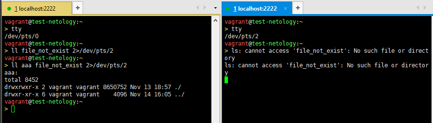
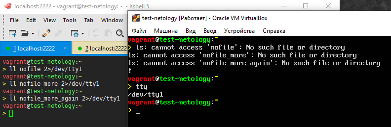
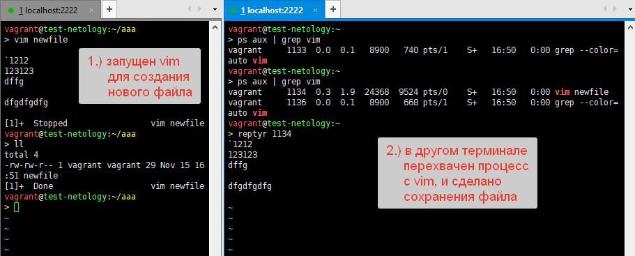

### 1. Какого типа команда `cd`?  
`cd` является командой, встроенной в оболочку `bash`. В терминах `bash` - это `shell-builtin`. Убедиться в этом можно с
помощью команд `type` и `builtin`. `type` явно сообщит, является указанная команда встроенной или нет. `builtin` вернет
статус `0`, если указанная команда является встроенной в командную оболочку. Если указанная команда не является 
встроенной в оболочку, то `builtin` вернет статус `1` и выведен сообщения об этом в `stderr`:    
```shell
> 
vagrant@test-netology:~
> type cd
cd is a shell builtin
vagrant@test-netology:~
> builtin cd
vagrant@test-netology:~
> builtin cd1
-bash: builtin: cd1: not a shell builtin
```
При этом команды `type` и `builtin` также являются встроенными командами оболочки `bash`.  
#### Субъективные предположения, почему именно так:  
`cd` сделана встроенной командой оболочки для того, чтобы выполнение этой команды в отдельном сеансе `bash` отдельного 
пользователя из многих возможных не приводило к изменению рабочего каталога для других выполняющихся в системе 
процессов. Кроме того, встроенные команды оболочки при выполнении не порождают дочерних процессов. Т.е. это некий уровень изоляции 
для каждого пользователя в многопользовательской операционной системе.  
### 2. Какая альтернатива без `pipe` команде `grep <some_string> <some_file> | wc -l`?
Альтернатива - использовать утилиту `grep` с ключом `-c, --count`:  
```shell
vagrant@test-netology:~
> echo "one
> two
> three
> oneone
> twothree
> four
> three
> five" > file.txt
vagrant@test-netology:~
> grep -c two file.txt 
2
vagrant@test-netology:~
> grep -c five file.txt 
1
vagrant@test-netology:~
> grep -c one file.txt 
2
vagrant@test-netology:~
> grep -c three file.txt 
3
```
### 3. Какой процесс с PID `1` является родителем для всех процессов:  
Это процесс системы инициализации, которая запускается первой после загрузки ядро ОС Linux. Поэтому ее PID всегда `1`.
В дистрибутиве Ubuntu 20.04, это `Systemd`, - одна из реализаций системы инициализации:  
```shell
vagrant@test-netology:~
> ps 1
    PID TTY      STAT   TIME COMMAND
      1 ?        Ss     0:01 /sbin/init
vagrant@test-netology:~
> ll /sbin/init
lrwxrwxrwx 1 root root 20 Jul 21 19:00 /sbin/init -> /lib/systemd/systemd*
```  
### 4. Как будет выглядеть команда, которая перенаправит вывод stderr `ls` на другую сессию терминала?    
```shell
vagrant@test-netology:~
> tty
/dev/pts/0
vagrant@test-netology:~
> ll file_not_exist 2>/dev/pts/2
```
  
### 5. Получится ли одновременно передать команде файл на `stdin` и вывести ее `stdout` в другой файл? Приведите работающий пример.  
```shell
vagrant@test-netology:~
> cat file.txt 
one
two
three
oneone
twothree
four
three
five
vagrant@test-netology:~
> cat file.txt | grep "four" > file_four.txt
vagrant@test-netology:~
> cat file_four.txt 
four
```
### 6. Получится ли находясь в графическом режиме, вывести данные из PTY в какой-либо из эмуляторов TTY? Сможете ли вы наблюдать выводимые данные?  
Получится, принцип тот же, как и в вопросе №4, но вместо псевдотерминала `pty` указываем перенаправление вывода `stderr` в устройство эмулятора терминал `tty`:  

  
### 7. Выполните команду `bash 5>&1`. К чему она приведет?  
Это приведет к тому, что будет запущен новый дочерний процесс оболочки `bash`. У этого дочернего процесса оболочки `bash` появится файловый дескриптор с идентификатором `5`. 
Файловый дескриптор `5` будет связан с устройством псевдотерминала, который связан с моим текущим сеансом оболочки `bash`:  
```shell
vagrant@test-netology:~
> echo $$
2600
vagrant@test-netology:~
> bash 5>&1
vagrant@test-netology:~
> echo $$
2613
vagrant@test-netology:~
> ll /proc/$$/fd
total 0
dr-x------ 2 vagrant vagrant  0 Nov 14 20:52 ./
dr-xr-xr-x 9 vagrant vagrant  0 Nov 14 20:52 ../
lrwx------ 1 vagrant vagrant 64 Nov 14 20:52 0 -> /dev/pts/0
lrwx------ 1 vagrant vagrant 64 Nov 14 20:52 1 -> /dev/pts/0
lrwx------ 1 vagrant vagrant 64 Nov 14 20:52 2 -> /dev/pts/0
lrwx------ 1 vagrant vagrant 64 Nov 14 20:52 255 -> /dev/pts/0
lrwx------ 1 vagrant vagrant 64 Nov 14 20:52 5 -> /dev/pts/0
vagrant@test-netology:~
> pstree -a -p
# часть вывода pstree удалена для удобства демонстрации
# в иерархии процессов видим, что у оболочки bash с PID==2600
# есть дочерний процесс оболочки bash с PID==2613
  │   ├─sshd,2537
  │   │   └─sshd,2568 
  │   │       └─bash,2569
  │   │           └─bash,2582
  │   │               └─bash,2600
  │   │                   └─bash,2613
  │   │                       └─pstree,2705 -a -p
```
Если далее выполнить команду `echo netology > /proc/$$/fd/5`, то увидим в `stdout` вывод:  
```shell
vagrant@test-netology:~
> echo netology > /proc/$$/fd/5
netology
```  
Так происходит, потому что файловый дескриптор с идентификатором `5` ранее командой `bash 5>&1` ,был связан с файловым дескриптором `1`, т.е. с `stdout`.  
### 8. Получится ли в качестве входного потока для `pipe` использовать только `stderr` команды, не потеряв при этом отображение `stdout` на `pty`?  
Получится:  
```shell
vagrant@test-netology:~/aaa
> rm -f *
vagrant@test-netology:~/aaa
> touch y_file
vagrant@test-netology:~/aaa
> ls y_file n_file 5>&2 2>&1 1>&5 | cat
y_file
ls: cannot access 'n_file': No such file or directory
```
Проверяем, что в `pipe` на `stdin` передается именно и только `stderr`, а не одновременно `stdout` и `stderr` или только `stdout`, 
добавив перенаправление вывода утилиты `cat` в `/dev/null`:  
```shell
vagrant@test-netology:~/aaa
> ls y_file n_file 5>&2 2>&1 1>&5 | cat > /dev/null
y_file
```  
и увидим, что в выводе остался только `stdout`, т.к. `stderr` был перенаправлен в `/dev/null`, т.е. в никуда. Отсюда делаем вывод, что в `pipe` был перенаправлен только `stderr`
 как результат выполнения предыдущей до `pipe` команды.  
### 9. Что выведет команда `cat /proc/$$/environ`?  
Файл содержит перечисление переменных окружения командной оболочки текущего сеанса `bash`. Аналогичную информацию можно просмотреть с помощью команд `env` без параметров или `printenv`.  
### 10. Используя man, опишите что доступно по адресам `/proc/<PID>/cmdline`, `/proc/<PID>/exe`.  
`/proc/[pid]/cmdline` - это файл, доступный только для чтения, содержит в себе информацию о том, какой командой (каким исполняемым файлом) был запущен процесс с соответствующим `PID`. 
Кроме команды запуска, в нем так же перечислены аргументы командной строки, разделенные нулевыми байтами. Для зомби процесса файл будет пустой, т.е. не содержащий никакой информации
 о своем происхождении.  
`/proc/[pid]/exe` - Начиная с версии Linux 2.2 этот файл является символической ссылкой на исполняемую команду. Если попытаться открыть этот симлинк, то будет исполнен исполняемый файл,
 на который он ссылается. Запустив такую ссылку, можно создать копию исходного процесса. Если путь, на который ссылается симлинк, был "отвязан" (удален ?), то симлинк будет содержать 
строку '(deleted)' в дополнении к пути до исполняемого файла. В многопоточных системах содержимое такого симлинка недоступно, если главный (родительский ?) поток уже был завершен.
В версии Linux 2.0 и более ранних этот файл был указателем на бинарный исполняемый файл, и отображался как символическая ссылка.  
### 11. Узнайте, какую наиболее старшую версию набора инструкций SSE поддерживает ваш процессор с помощью `/proc/cpuinfo`  
Ответ: SSE4.2
```shell
vagrant@test-netology:~/aaa
>cat /proc/cpuinfo | grep -i sse | sed s/" "/"\\n"/g | grep -i sse 
sse
sse2
ssse3
sse4_1
sse4_2
```  
### 12. При открытии нового окна терминала и `vagrant ssh` создается новая сессия и выделяется pty.  
Нужно добавить ключ `-t` для принудительного выделения псевдотерминала новому ssh-подключению, а если локальное устройство `tty` отсутствует, то `-tt`:  
```shell
vagrant@test-netology:~
> tty
/dev/pts/2
vagrant@test-netology:~
> ssh localhost 'tty'
vagrant@localhost's password: 
not a tty
vagrant@test-netology:~
> ssh localhost -t 'tty'
vagrant@localhost's password: 
/dev/pts/3
Connection to localhost closed.
vagrant@test-netology:~
> ssh localhost -tt 'tty'
vagrant@localhost's password: 
/dev/pts/3
Connection to localhost closed.
```  
### 13. Использование `reptyr` для перехвата процесса в другом терминале:  
  
### 14. Узнайте что делает команда `tee` и почему в отличие от `sudo echo` команда с sudo `tee будет` работать.  
`tee` читает данные из `stdin` или из файла и записывает их в `stdout` либо файлы. При чем `tee` позволяет данные из `stdin` записать одновременно в множество файлов, т.е. 
`tee` как бы размножает один источник информации в разные целевые файлы:  
```shell
vagrant@test-netology:~
> echo string | sudo tee /root/new_file1 /root/new_file2 /root/new_file3
string
vagrant@test-netology:~
> sudo ls -l /root/
total 12
-rw-r--r-- 1 root root 7 Nov 15 18:13 new_file1
-rw-r--r-- 1 root root 7 Nov 15 18:13 new_file2
-rw-r--r-- 1 root root 7 Nov 15 18:13 new_file3
```  
Команда `tee` это исполняемый файл, в то время как `echo` - это встроенная команда оболочки `bash`:  
```shell
> type tee
tee is /usr/bin/tee
vagrant@test-netology:~
> type echo
echo is a shell builtin
```  
Именно поэтому выполнение `sudo echo string > /root/new_file` не работает, т.к. в этом случае `echo` не создает новый дочерний процесс оболочки `bash` с привилегиями `root`- пользователя,
а продолжает выполняться в текущем процессе оболочки, не обладающего `root`-привилегиями. Как результат, у такого процесса не будет прав для создания файла в домашнем каталоге
пользователя `root`.    
Конструкция `echo string | sudo tee /root/new_file` передает `stdout` от непривилегированного процесса оболочки `bash` на `stdin` привилегированному процессу `tee`. Т.к `tee` - это 
исполняемый файл, а не встроенная команда оболочки `bash`, то при его исполнении будет создан новый процесс с привилегиями `root`-пользователя, а значит у такого процесса 
будут права на запись в домашний каталог пользователя `root`.