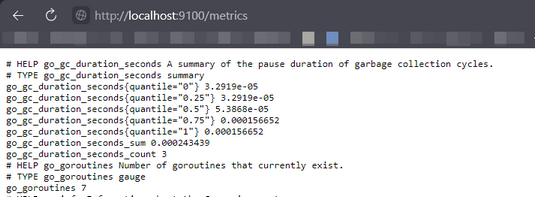
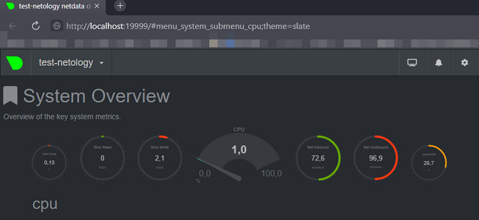
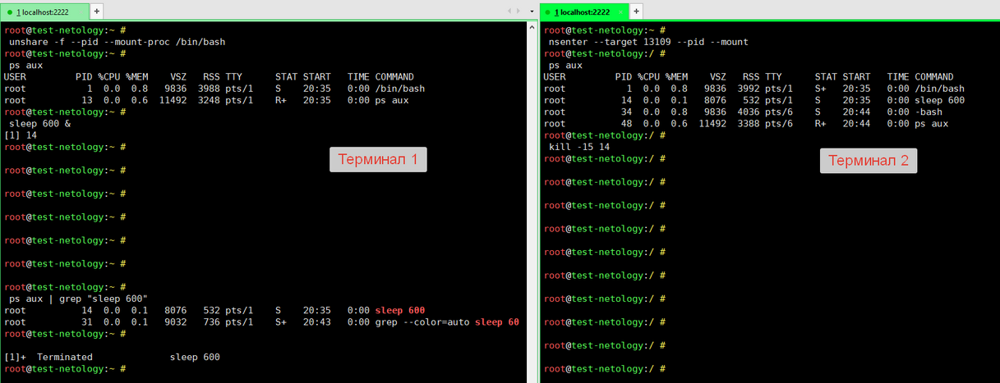
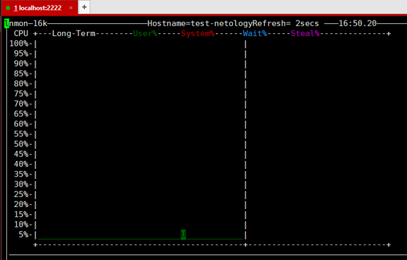
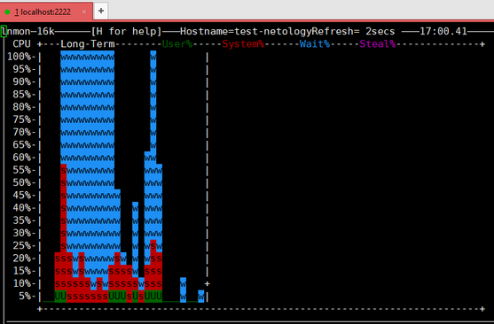

### 1. `node_exporter` и `Systemd`  
Создаем нового пользователя:  
```shell
root@test-netology:~ #
 sudo useradd -r -M -s /bin/false node_exporter
# -r, --system          Create a system account.
# -M, --no-create-home  Do no create the user's home directory
# -s, --shell SHELL     The name of the user's login shell
```

Скачиваем и устанавливаем бинарник `node_exporter`:  
```shell
root@test-netology:~ #
 wget -q https://github.com/prometheus/node_exporter/releases/download/v1.3.0/node_exporter-1.3.0.linux-amd64.tar.gz -P /tmp && \
 tar -xzf /tmp/node_exporter-1.3.0.linux-amd64.tar.gz -C /tmp && \
 cp /tmp/node_exporter-1.3.0.linux-amd64/node_exporter /usr/bin/ && \
 node_exporter --version

node_exporter, version 1.3.0 (branch: HEAD, revision: c65f870ef90a4088210af0319498b832360c3366)
  build user:       root@4801f8f250a6
  build date:       20211118-16:34:14
  go version:       go1.17.3
  platform:         linux/amd64
```

Создаем юнит `systemd` для `node_exporter`
```shell
root@test-netology:~#
cat > /etc/systemd/system/node_exporter.service << EOF
[Unit]
Description="Prometheus Node Exporter"
Wants=network-online.target
After=network-online.target

[Service]
User=node_exporter
Group=node_exporter
Type=simple
EnvironmentFile=-/etc/node_exporter/options
ExecStart=/usr/bin/node_exporter $OPTIONS

[Install]
WantedBy=multi-user.target
```

Создаем `EnvironmentFile`:  
```shell
root@test-netology:~ #
 mkdir -p /etc/node_exporter && touch /etc/node_exporter/options
 cat > /etc/node_exporter/options << EOF
 OPTIONS="--collector.cpu \
 --collector.cpu.info \
 --collector.ethtool.device-include='eth0'"
```

Обновляем конфигурацию `systemd`:  
```shell
root@test-netology:~ #
 sudo systemctl daemon-reload
```
Добаавляем демон `node_exporter.service` в автозагрузку:  
```shell
root@test-netology:~ #
 systemctl enable node_exporter
Created symlink /etc/systemd/system/multi-user.target.wants/node_exporter.service → /etc/systemd/system/node_exporter.service.
```
Запускаем демон `node_exporter`:  
```shell
root@test-netology:~ #
 systemctl start node_exporter
root@test-netology:~ #
 systemctl status node_exporter
● node_exporter.service - "Prometheus Node Exporter"
     Loaded: loaded (/etc/systemd/system/node_exporter.service; enabled; vendor preset: enabled)
     Active: active (running) since Mon 2021-11-22 20:15:27 UTC; 2s ago
   Main PID: 1842 (node_exporter)
      Tasks: 3 (limit: 467)
     Memory: 2.2M
     CGroup: /system.slice/node_exporter.service
             └─1842 /usr/bin/node_exporter --collector.cpu --collector.cpu.info --collector.ethtool.device-include=eth
```


### 2. Ознакомьтесь с опциями `node_exporter` и выводом `/metrics` по-умолчанию. Приведите несколько опций, которые вы бы выбрали для базового мониторинга хоста по CPU, памяти, диску и сети.  

  

Для базового мониторинга можно использовать метрики:  
- использование времени CPU различными процессами (пользовательские, ядро, ввод-вывод, прерывания и т.д.):  

        node_cpu_seconds_total{cpu="0",mode="idle"} 609.26
        node_cpu_seconds_total{cpu="0",mode="iowait"} 18.44
        node_cpu_seconds_total{cpu="0",mode="irq"} 0
        node_cpu_seconds_total{cpu="0",mode="nice"} 0
        node_cpu_seconds_total{cpu="0",mode="softirq"} 0.09
        node_cpu_seconds_total{cpu="0",mode="steal"} 0
        node_cpu_seconds_total{cpu="0",mode="system"} 4.46
        node_cpu_seconds_total{cpu="0",mode="user"} 3.86
- использование RAM:  

        node_memory_MemTotal_bytes 5.0122752e+08
        node_memory_MemAvailable_bytes 3.72645888e+08
        node_memory_MemFree_bytes 1.7702912e+08
- использование сети:  

        node_network_receive_bytes_total{device="eth0"} 212698
        node_network_receive_drop_total{device="eth0"} 0
        node_network_receive_errs_total{device="eth0"} 0
        node_network_receive_packets_total{device="eth0"} 2537
        node_network_transmit_bytes_total{device="eth0"} 432272
        node_network_transmit_drop_total{device="eth0"} 0
        node_network_transmit_errs_total{device="eth0"} 0
        node_network_transmit_packets_total{device="eth0"} 1913
- использование файловых систем и дисков (ввод-вывод):  

        node_filesystem_avail_bytes{device="/dev/mapper/vgvagrant-root",fstype="ext4",mountpoint="/"} 6.0696621056e+10  
        node_filesystem_avail_bytes{device="/dev/sda1",fstype="vfat",mountpoint="/boot/efi"} 5.35801856e+08
        node_filesystem_avail_bytes{device="vagrant",fstype="vboxsf",mountpoint="/vagrant"} 1.067537629184e+12
        node_filesystem_free_bytes{device="/dev/mapper/vgvagrant-root",fstype="ext4",mountpoint="/"} 6.4070938624e+10
        node_filesystem_free_bytes{device="/dev/sda1",fstype="vfat",mountpoint="/boot/efi"} 5.35801856e+08
        node_filesystem_free_bytes{device="vagrant",fstype="vboxsf",mountpoint="/vagrant"} 1.067537629184e+12
        node_disk_read_bytes_total{device="dm-0"} 1.88785664e+08
        node_disk_read_bytes_total{device="dm-1"} 3.342336e+06
        node_disk_read_bytes_total{device="sda"} 2.02520576e+08
        node_disk_written_bytes_total{device="dm-0"} 1.2509184e+07
        node_disk_written_bytes_total{device="dm-1"} 0
        node_disk_written_bytes_total{device="sda"} 1.2301312e+07
        node_disk_read_time_seconds_total{device="dm-0"} 188.288
        node_disk_read_time_seconds_total{device="dm-1"} 0.496
        node_disk_read_time_seconds_total{device="sda"} 79.128
        node_disk_write_time_seconds_total{device="dm-0"} 7.844
        node_disk_write_time_seconds_total{device="dm-1"} 0
        node_disk_write_time_seconds_total{device="sda"} 7.2780000000000005


### 3. Netdata:  
  


### 4. Можно ли по выводу `dmesg` понять, осознает ли ОС, что загружена не на настоящем оборудовании, а на системе виртуализации?  
Да, при загрузке ОС понимает это:  
```shell
vagrant@test-netology:~ $
 dmesg -H | grep -i -e virt -e kvm
[  +0.000000] DMI: innotek GmbH VirtualBox/VirtualBox, BIOS VirtualBox 12/01/2006
[  +0.000000] Hypervisor detected: KVM
[  +0.000000] kvm-clock: Using msrs 4b564d01 and 4b564d00
[  +0.000000] kvm-clock: cpu 0, msr 12601001, primary cpu clock
[  +0.000000] kvm-clock: using sched offset of 4745271721 cycles
[  +0.000000] clocksource: kvm-clock: mask: 0xffffffffffffffff max_cycles: 0x1cd42e4dffb, max_idle_ns: 881590591483 ns
[  +0.000001] CPU MTRRs all blank - virtualized system.
[  +0.000001] Booting paravirtualized kernel on KVM
[  +0.000712] clocksource: Switched to clocksource kvm-clock
[  +0.000027] systemd[1]: Detected virtualization oracle.
```


### 5. Как настроен sysctl `fs.nr_open` на системе по-умолчанию? Узнайте, что означает этот параметр. Какой другой существующий лимит не позволит достичь такого числа (`ulimit --help`)?  
    man 5 proc
    
    /proc/sys/fs/nr_open (since Linux 2.6.25)
    
    This file imposes ceiling on the value to which the  RLIMIT_NOFILE  resource  limit
    can  be  raised (see getrlimit(2)).  This ceiling is enforced for both unprivileged
    and privileged process.  The default value in this file is 1048576.  (Before  Linux
    2.6.25, the ceiling for RLIMIT_NOFILE was hard-coded to the same value.)
Параметр `nr_open` накладывает ограничение на значение, до которого может быть увеличено количество открытых файлов (`NOFILE`) для
процесса конкретного пользователя с помощью `ulimit -n`. Ограничение работает как для непривилегированных, так и для привилегированных
процессов. Например:  
значение `fs.nr_open` по умолчанию:  
```shell
root@test-netology:~ #
 sysctl fs.nr_open
fs.nr_open = 1048576
```
попробуем установить с помощью `ulimit -n` количество максимально открытых файлов (`NOFILE`) больше, чем 1048576. ОС не позволит этого сделать:  
```shell
root@test-netology:~ #
 ulimit -n
1024
root@test-netology:~ #
 ulimit -n 2000000
-bash: ulimit: open files: cannot modify limit: Operation not permitted
```
увеличим значение для `fs.nr_open` в ОС:  
```shell
root@test-netology:~ #
 sysctl -w fs.nr_open=2500000
fs.nr_open = 2500000
root@test-netology:~ #
 sysctl fs.nr_open
fs.nr_open = 2500000
```
и повторим попытку установить с помощью `ulimit -n` количество максимально открытых файлов больше (`NOFILE`), чем дефолтные исходные `fs.nr_open = 1048576`:  
```shell
root@test-netology:~ #
 ulimit -n 2000000
root@test-netology:~ #
 ulimit -n
2000000
```
При необходимости с помощью `ulimit -n` можно для конкретного пользователя установить ограничение на количество 
открытых файлов (`NOFILE`) меньшее, чем установленное параметром `fs.nr_open` в ОС. Для этого в файл `/etc/security/limits.conf` 
нужно добавить записи:  
```shell
vagrant	soft	nofile	1000
vagrant	hard	nofile	1000
```
после этого для всех новых процессов командной оболочки лимит на `NOFILE` будет переопределен, и пользователь не сможет
его превысить:  
```shell
vagrant@test-netology:~ $
 ulimit -n
1000
vagrant@test-netology:~ $
 ulimit -n 2000
-bash: ulimit: open files: cannot modify limit: Operation not permitted
```


### 6. Namespace  
Терминал 1:  
```shell
# Запускаем `bash` в новом пространстве имен PID
root@test-netology:~ #
 unshare -f --pid --mount-proc /bin/bash

# Проверяем, что пространство имен создалось:
root@test-netology:~ #
 ps aux
USER         PID %CPU %MEM    VSZ   RSS TTY      STAT START   TIME COMMAND
root           1  0.0  0.8   9836  3988 pts/1    S    20:35   0:00 /bin/bash
root          13  0.0  0.6  11492  3248 pts/1    R+   20:35   0:00 ps aux

# Запускаем новый процесс в фоне:
root@test-netology:~ #
 sleep 600 &
[1] 14
# Процесс создался с PID=14 в новом пространсве имен PID.
```

Терминал 2:  
```shell
# Ищем PID процесса в родительском пространстве имен PID. Это будет процесс с PID=13109:  
root@test-netology:~ #
 ps aux | grep "sleep 600"
root       13109  0.0  0.1   8076   532 pts/1    S    20:35   0:00 sleep 600
root       13154  0.0  0.1   9032   676 pts/6    S+   20:44   0:00 grep --color=auto sleep 600

# Подключаемся к пространству имен PID процесса с PID=13109, созданного ранее в Терминале 1:
root@test-netology:~ #
 nsenter --target 13109 --pid --mount

# Проверяем, что попали в пространстов имен, в котором есть процесс с PID=14, соответствующий процессу "sleep 600":
root@test-netology:/ #
 ps aux
USER         PID %CPU %MEM    VSZ   RSS TTY      STAT START   TIME COMMAND
root           1  0.0  0.8   9836  3992 pts/1    S+   20:35   0:00 /bin/bash
root          14  0.0  0.1   8076   532 pts/1    S    20:35   0:00 sleep 600
root          34  0.0  0.8   9836  4036 pts/6    S    20:44   0:00 -bash
root          48  0.0  0.6  11492  3388 pts/6    R+   20:44   0:00 ps aux

# Завершаем процесс с PID=14:
root@test-netology:/ #
 kill -15 14
```
Терминал 1:  
```shell
# В терминале 1 видим, что процесс с PID=13109 завершился:
root@test-netology:~ #
 
[1]+  Terminated              sleep 600
```



### 7. fork-bomb `:(){ :|:& };:`:  
fork-bomb порождает множество дочерних процессов, которые клонируются друг от друга и занимают все системные ресурсы.   
Смотрим сообщения kernel buffer ring и видим следующее:  
```shell
[Nov24 21:00] cgroup: fork rejected by pids controller in /user.slice/user-1000.slice/session-24.scope
```
ОС "спас" от полного оверлоада механизм контроля за группой процессов - `cgroup`. По умолчанию, он настроен так, чтобы 
группе процессов выделялось некоторое число процессов в количественном или процентом соотношении от максимально 
возможного числа процессов в ОС. Ограничение устанавливается демоном `user.slice`, в юните которого есть параметр 
`TasksMax=33%`:  
```shell
root@test-netology:~ #
 cat /usr/lib/systemd/system/user-.slice.d/10-defaults.conf 

[Unit]
Description=User Slice of UID %j
Documentation=man:user@.service(5)
After=systemd-user-sessions.service
StopWhenUnneeded=yes

[Slice]
TasksMax=33%
```
Максимально возможное количество при этом:  
```shell
root@test-netology:~ #
 systemctl show --property DefaultTasksMax
DefaultTasksMax=467
```
Чтобы ограничить максимальное число процессов в текущем сеансе, нужно установить ограничение на кол-во процессов:  
```shell
vagrant@test-netology:~ $
 ulimit -u
1559

vagrant@test-netology:~ $
 ulimit -u 5

vagrant@test-netology:~ $
 :(){ :|:& };:
-bash: fork: retry: Resource temporarily unavailable
-bash: fork: retry: Resource temporarily unavailable
-bash: fork: retry: Resource temporarily unavailable
-bash: fork: retry: Resource temporarily unavailable
-bash: fork: Resource temporarily unavailable
vagrant@test-netology:~ $
```
Никакой нагрузки на ОС в этом случае не возникло:  


Без ограничений по `ulimit -u 5` картина совершенно иная:




