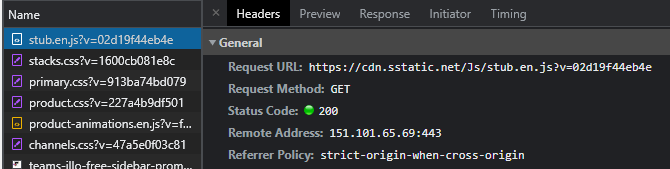
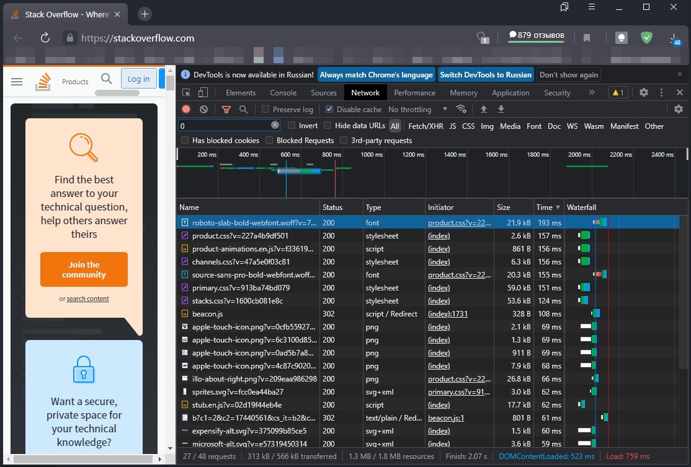
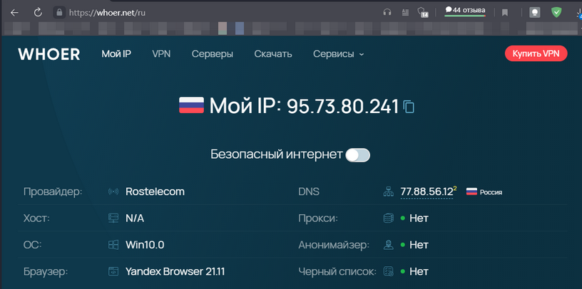

### 1. Работа c HTTP через телнет.  
```shell
vagrant@test-netology:~$
 telnet stackowerflow.com 80
Trying 103.224.182.253...
Connected to stackowerflow.com.
Escape character is '^]'.
GET /questions HTTP/1.0
HOST: stackoverflow.com

HTTP/1.1 302 Found
Date: Tue, 30 Nov 2021 18:01:24 GMT
Server: Apache/2.4.25 (Debian)
Set-Cookie: __tad=1638295284.7037916; expires=Fri, 28-Nov-2031 18:01:24 GMT; Max-Age=315360000
Location: http://instantfwding.com/?dn=stackoverflow.com&pid=7PO2UM885
Content-Length: 0
Connection: close
Content-Type: text/html; charset=UTF-8

Connection closed by foreign host.
```
[RFC2616](https://www.w3.org/Protocols/rfc2616/rfc2616-sec10.html#sec10.3.3):  

`302 Found` - запрашиваемый ресурс найден, временно находится под другим URI. Т.к. в дальнейшем перенаправление 
может быть изменено, то клиент должен продолжать использовать URI-запрос для будущих запросов. Этот ответ можно
кешировать на клиенте только в том случае, если ответ содержит заголовки Cache-Control или Expires.

### 2. Повторите задание 1 в браузере, используя консоль разработчика F12.  
- Код первого ответа `200 OK` - запрос выполнен успешно:  
    

- Время загрузки страницы 759 миллисекунд
- Дольше всего обрабатывался запрос `https://cdn.sstatic.net/Fonts/roboto-slab/roboto-slab-bold-webfont.woff?v=719d1c709127`, 193 миллисекунды:  
    
    

### 3. Какой IP адрес у вас в интернете?  
Мой IP `95.73.80.241`  




### 4. Какому провайдеру принадлежит ваш IP адрес? Какой автономной системе AS? Воспользуйтесь утилитой `whois`  
Мой IP принадлежит провайдеру _OJSC Rostelecom_, автономная система _AS12389_:  

```shell
vagrant@test-netology:~$
 whois -h whois.ripe.net 95.73.80.241

% This is the RIPE Database query service.
% The objects are in RPSL format.
%
% The RIPE Database is subject to Terms and Conditions.
% See http://www.ripe.net/db/support/db-terms-conditions.pdf

% Note: this output has been filtered.
%       To receive output for a database update, use the "-B" flag.

% Information related to '95.73.80.0 - 95.73.83.255'

% Abuse contact for '95.73.80.0 - 95.73.83.255' is 'abuse@rt.ru'

inetnum:        95.73.80.0 - 95.73.83.255
netname:        MACROREGIONAL_CENTER
descr:          ex-netname: CTC-DSLAM-2
descr:          OJSC Rostelecom, Moscow Region Branch
descr:          DSL access network in  Moscow region
country:        RU
admin-c:        CTC1-RIPE
tech-c:         CTC1-RIPE
status:         ASSIGNED PA
mnt-by:         MNT-CTC
created:        2011-10-27T12:26:43Z
last-modified:  2012-08-17T12:53:13Z
source:         RIPE

role:           OJSC Rostelecom
address:        29/2 Narodnogo Opolcheniya str.,
address:        123154, Moscow
abuse-mailbox:  ripe@rt.ru
admin-c:        DAR25515
admin-c:        AY25515
admin-c:        YT25515
admin-c:        SRK1-RIPE
tech-c:         DAR25515
tech-c:         AY25515
tech-c:         YT25515
nic-hdl:        CTC1-RIPE
mnt-by:         MNT-CTC
created:        2009-06-29T07:45:40Z
last-modified:  2018-06-18T13:06:42Z
source:         RIPE # Filtered

% Information related to '95.73.80.0/21AS12389'

route:          95.73.80.0/21
descr:          Rostelecom networks
origin:         AS12389
mnt-by:         ROSTELECOM-MNT
created:        2018-10-31T12:34:46Z
last-modified:  2018-10-31T12:34:46Z
source:         RIPE # Filtered

% This query was served by the RIPE Database Query Service version 1.101 (WAGYU)
```


### 5. Через какие сети проходит пакет, отправленный с вашего компьютера на адрес `8.8.8.8`? Через какие AS? Воспользуйтесь утилитой `traceroute`  
Пакет до `8.8.8.8` проходит через сети и автономные системы [AS****]:  
```shell
root@test-netology:~#
 traceroute -AnI 8.8.8.8
traceroute to 8.8.8.8 (8.8.8.8), 30 hops max, 60 byte packets
 1  10.0.2.2 [*]  0.154 ms  0.132 ms  0.128 ms
 2  192.168.10.1 [*]  2.188 ms  2.241 ms  3.493 ms
 3  213.140.228.144 [AS25515]  5.850 ms  5.847 ms  5.843 ms
 4  188.254.15.137 [AS12389]  8.077 ms  8.071 ms  8.067 ms
 5  87.226.183.85 [AS12389]  9.063 ms  9.040 ms  9.035 ms
 6  72.14.205.132 [AS15169]  12.243 ms  7.341 ms  7.531 ms
 7  216.239.49.19 [AS15169]  7.794 ms  8.653 ms  8.640 ms
 8  108.170.250.99 [AS15169]  8.996 ms  9.107 ms  9.145 ms
 9  172.253.66.116 [AS15169]  25.279 ms  25.274 ms  25.406 ms
10  172.253.66.108 [AS15169]  22.639 ms  23.068 ms  23.258 ms
11  142.250.208.23 [AS15169]  23.828 ms  24.149 ms  25.103 ms
12  * * *
13  * * *
14  * * *
15  * * *
16  * * *
17  * * *
18  * * *
19  * * *
20  * * *
21  * * *
22  * 8.8.8.8 [AS15169]  24.889 ms *
```
`traceroute` без опции `-I, --icmp  Use ICMP ECHO for probes` оказался неинформативен:  
```shell
root@test-netology:~#
 traceroute -An 8.8.8.8
traceroute to 8.8.8.8 (8.8.8.8), 30 hops max, 60 byte packets
 1  10.0.2.2 [*]  0.147 ms  0.122 ms  0.117 ms
 2  * * *
 3  * * *
 4  * * *
 5  * * *
 6  * * *
 7  * * *
 8  * * *
 9  * * *
10  * * *
11  * * *
12  * * *
13  * * *
14  * * *
15  * * *
16  * * *
17  10.0.2.2 [*]  21.779 ms * *
```


### 6. Повторите задание 5 в утилите `mtr`. На каком участке наибольшая задержка - delay?  
Наибольшая задержка на участке  
```shell
Host                                                    Loss%   Snt   Last   Avg  Best  Wrst StDev
9. AS15169  172.253.66.116                               0.0%    13   28.4  27.3  25.1  30.3   1.7
```
Если принимать за основу среднее значение ответа, то на участке
```shell
Host                                                    Loss%   Snt   Last   Avg  Best  Wrst StDev
11. AS15169  142.250.208.23                               0.0%    13   25.4  28.3  25.0  50.9   7.1
```

```shell
root@test-netology:~#
 mtr -z -n 8.8.8.8

# Интерактивный вывод:
                                       My traceroute  [v0.93]
test-netology (10.0.2.15)                                                  2021-11-30T20:16:14+0000
Keys:  Help   Display mode   Restart statistics   Order of fields   quit
                                                           Packets               Pings
 Host                                                    Loss%   Snt   Last   Avg  Best  Wrst StDev
 1. AS???    10.0.2.2                                     0.0%    13    0.3   0.2   0.1   0.5   0.1
 2. AS???    192.168.10.1                                 0.0%    13    1.5   2.4   1.5   6.2   1.7
 3. AS25515  213.140.228.144                              0.0%    13    7.2   6.5   3.4  14.9   3.2
 4. AS12389  188.254.15.137                               0.0%    13    8.6   9.7   6.0  17.6   3.9
 5. AS12389  87.226.183.85                                0.0%    13    6.3   7.3   6.0  10.2   1.4
 6. AS15169  72.14.205.132                                0.0%    13    7.1   8.4   7.1  11.2   1.4
 7. AS15169  216.239.49.19                                0.0%    13    7.7   8.5   7.1  12.1   1.7
 8. AS15169  108.170.250.99                               0.0%    13    7.9   8.4   7.6  11.4   1.0
 9. AS15169  172.253.66.116                               0.0%    13   28.4  27.3  25.1  30.3   1.7
10. AS15169  172.253.66.108                               0.0%    13   24.5  26.6  22.3  49.0   7.5
11. AS15169  142.250.208.23                               0.0%    13   25.4  28.3  25.0  50.9   7.1
12. (waiting for reply)
13. (waiting for reply)
14. (waiting for reply)
15. (waiting for reply)
16. (waiting for reply)
17. (waiting for reply)
18. AS15169  8.8.8.8                                     81.8%    12   29.7  29.3  28.9  29.7   0.6
```


### 7. Какие DNS сервера отвечают за доменное имя dns.google? Какие A записи? Воспользуйтесь утилитой `dig`  
За доменное имя dns.google отвечают dns-сервера:  
```shell
root@test-netology:~#
 dig ns dns.google

; <<>> DiG 9.16.1-Ubuntu <<>> ns dns.google
;; global options: +cmd
;; Got answer:
;; ->>HEADER<<- opcode: QUERY, status: NOERROR, id: 35502
;; flags: qr rd ra; QUERY: 1, ANSWER: 4, AUTHORITY: 0, ADDITIONAL: 1

;; OPT PSEUDOSECTION:
; EDNS: version: 0, flags:; udp: 65494
;; QUESTION SECTION:
;dns.google.			IN	NS

;; ANSWER SECTION:
dns.google.		5457	IN	NS	ns4.zdns.google.
dns.google.		5457	IN	NS	ns1.zdns.google.
dns.google.		5457	IN	NS	ns3.zdns.google.
dns.google.		5457	IN	NS	ns2.zdns.google.

;; Query time: 0 msec
;; SERVER: 127.0.0.53#53(127.0.0.53)
;; WHEN: Tue Nov 30 20:54:15 UTC 2021
;; MSG SIZE  rcvd: 116
```
A-записи:  
```shell
root@test-netology:~#
 dig a dns.google

; <<>> DiG 9.16.1-Ubuntu <<>> a dns.google
;; global options: +cmd
;; Got answer:
;; ->>HEADER<<- opcode: QUERY, status: NOERROR, id: 14492
;; flags: qr rd ra; QUERY: 1, ANSWER: 2, AUTHORITY: 0, ADDITIONAL: 1

;; OPT PSEUDOSECTION:
; EDNS: version: 0, flags:; udp: 65494
;; QUESTION SECTION:
;dns.google.			IN	A

;; ANSWER SECTION:
dns.google.		74	IN	A	8.8.8.8
dns.google.		74	IN	A	8.8.4.4

;; Query time: 0 msec
;; SERVER: 127.0.0.53#53(127.0.0.53)
;; WHEN: Tue Nov 30 20:54:04 UTC 2021
;; MSG SIZE  rcvd: 71
```

Полный вывод `dig`: 
```shell
root@test-netology:~#
 dig +trace dns.google

; <<>> DiG 9.16.1-Ubuntu <<>> +trace dns.google
;; global options: +cmd
.			9842	IN	NS	f.root-servers.net.
.			9842	IN	NS	j.root-servers.net.
.			9842	IN	NS	c.root-servers.net.
.			9842	IN	NS	g.root-servers.net.
.			9842	IN	NS	a.root-servers.net.
.			9842	IN	NS	h.root-servers.net.
.			9842	IN	NS	l.root-servers.net.
.			9842	IN	NS	d.root-servers.net.
.			9842	IN	NS	e.root-servers.net.
.			9842	IN	NS	b.root-servers.net.
.			9842	IN	NS	k.root-servers.net.
.			9842	IN	NS	i.root-servers.net.
.			9842	IN	NS	m.root-servers.net.
;; Received 262 bytes from 127.0.0.53#53(127.0.0.53) in 11 ms

google.			172800	IN	NS	ns-tld1.charlestonroadregistry.com.
google.			172800	IN	NS	ns-tld2.charlestonroadregistry.com.
google.			172800	IN	NS	ns-tld3.charlestonroadregistry.com.
google.			172800	IN	NS	ns-tld4.charlestonroadregistry.com.
google.			172800	IN	NS	ns-tld5.charlestonroadregistry.com.
google.			86400	IN	DS	6125 8 2 80F8B78D23107153578BAD3800E9543500474E5C30C29698B40A3DB2 3ED9DA9F
google.			86400	IN	RRSIG	DS 8 1 86400 20211213170000 20211130160000 14748 . ECg4SsWSHcQitvTXozZw5wgkGa2nZN0cuglg2puBDWDnRVCqAaT0hRFK a1hucQvtyVHMngDKnKXW6BUImxpvjN9pRU4YtltH0CbRkFyykaA3UTDC xmb2EZHD5bH453xnKCVwXx0b4PO7u7IBzjMOggXj0GKK2PRXq1wiYYAy NqgzoJ/GIdE7tx9myZ5WAuEXUUF6zLIwCCafILVvF/Cry/5v6kxuLdtJ ayaGSFfW+UpWSwjLD2Ue6rClZSmh/3br8cM25v4JS72C6CX+rKoFs9lU 9UZqFRr2d/+KIqNpJ5K4lI6/xppZYUSput9g1/tHYOV7WblhLs0lIJKz VTfbcg==
;; Received 730 bytes from 199.7.91.13#53(d.root-servers.net) in 51 ms

dns.google.		10800	IN	NS	ns3.zdns.google.
dns.google.		10800	IN	NS	ns1.zdns.google.
dns.google.		10800	IN	NS	ns2.zdns.google.
dns.google.		10800	IN	NS	ns4.zdns.google.
dns.google.		3600	IN	DS	56044 8 2 1B0A7E90AA6B1AC65AA5B573EFC44ABF6CB2559444251B997103D2E4 0C351B08
dns.google.		3600	IN	RRSIG	DS 8 2 3600 20211221073057 20211129073057 8830 google. 3gzis3UAc1P3Gapan3nCPNxIXXcTirligYTysMIAJxXY4QXDlAtjsx28 RQ1XoNWkkWCGRAMZBR3YYoWJD3gDCJeDtxAdPTMlb7rx3F1pw2oUtcdQ Yor4PjISZ8Z7uK7VhWSx7cR5IqpmGvN2CeXpjv2XJdH2J89jjudCgWzU 5g0=
;; Received 506 bytes from 216.239.32.105#53(ns-tld1.charlestonroadregistry.com) in 55 ms

dns.google.		900	IN	A	8.8.8.8
dns.google.		900	IN	A	8.8.4.4
dns.google.		900	IN	RRSIG	A 8 2 900 20211230161039 20211130161039 1773 dns.google. WZsaUGTLCI3XH7g+/Xgo9Lz9g5KEa53r90C5+sJ0KzmjQsNRBqbThHEz P1esYVsEScVJEOvLFjrWNMWav2reZYNYcIEcBpcEURIBkvFjeA864gsH 1YgMYcvERqS3FBx8vS3Cx5EzIFtTP395pxyrPw+H88W7Jz9r+7Zj42Ob mGA=
;; Received 241 bytes from 216.239.34.114#53(ns2.zdns.google) in 51 ms
```

### 8. Проверьте PTR записи для IP адресов из задания 7. Какое доменное имя привязано к IP? Воспользуйтесь утилитой `dig`  
PTR-записи для 8.8.8.8 и 8.8.4.4:  

    8.8.8.8.in-addr.arpa.	1431	IN	PTR	dns.google.
    4.4.8.8.in-addr.arpa.	1686	IN	PTR	dns.google.

К IP `8.8.8.8` и `8.8.4.4` привязано доменное имя `dns.google.`

```shell
root@test-netology:~#
 dig ptr -x 8.8.8.8

; <<>> DiG 9.16.1-Ubuntu <<>> ptr -x 8.8.8.8
;; global options: +cmd
;; Got answer:
;; ->>HEADER<<- opcode: QUERY, status: NOERROR, id: 10261
;; flags: qr rd ra; QUERY: 1, ANSWER: 1, AUTHORITY: 0, ADDITIONAL: 1

;; OPT PSEUDOSECTION:
; EDNS: version: 0, flags:; udp: 65494
;; QUESTION SECTION:
;8.8.8.8.in-addr.arpa.		IN	PTR

;; ANSWER SECTION:
8.8.8.8.in-addr.arpa.	1431	IN	PTR	dns.google.

;; Query time: 0 msec
;; SERVER: 127.0.0.53#53(127.0.0.53)
;; WHEN: Tue Nov 30 20:59:28 UTC 2021
;; MSG SIZE  rcvd: 73


root@test-netology:~#
 dig ptr -x 8.8.4.4

; <<>> DiG 9.16.1-Ubuntu <<>> ptr -x 8.8.4.4
;; global options: +cmd
;; Got answer:
;; ->>HEADER<<- opcode: QUERY, status: NOERROR, id: 40055
;; flags: qr rd ra; QUERY: 1, ANSWER: 1, AUTHORITY: 0, ADDITIONAL: 1

;; OPT PSEUDOSECTION:
; EDNS: version: 0, flags:; udp: 65494
;; QUESTION SECTION:
;4.4.8.8.in-addr.arpa.		IN	PTR

;; ANSWER SECTION:
4.4.8.8.in-addr.arpa.	1686	IN	PTR	dns.google.

;; Query time: 0 msec
;; SERVER: 127.0.0.53#53(127.0.0.53)
;; WHEN: Tue Nov 30 20:59:30 UTC 2021
;; MSG SIZE  rcvd: 73
```