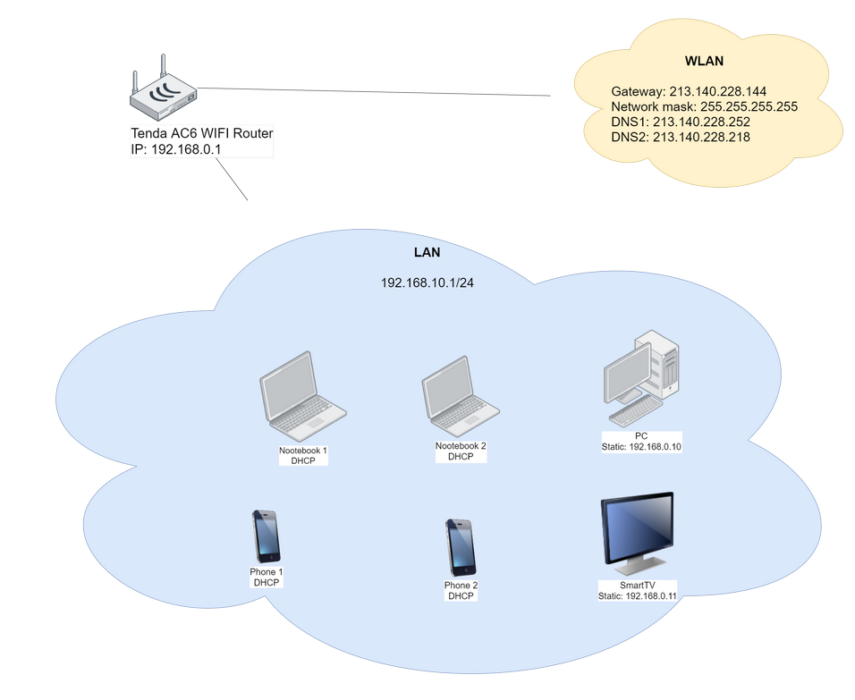

### 1. Подключитесь к публичному маршрутизатору в интернет. Найдите маршрут к вашему публичному IP
Маршрут до адреса 95.72.61.47:  
```shell
route-views>show ip route 95.72.61.47
Routing entry for 95.72.56.0/21
  Known via "bgp 6447", distance 20, metric 0
  Tag 6939, type external
  Last update from 64.71.137.241 1w5d ago
  Routing Descriptor Blocks:
  * 64.71.137.241, from 64.71.137.241, 1w5d ago
      Route metric is 0, traffic share count is 1
      AS Hops 2
      Route tag 6939
      MPLS label: none
```
Все маршруты до адреса 95.72.61.47, анонсированные по протоколу BGP:   
```shell
route-views>show bgp 95.72.61.47
BGP routing table entry for 95.72.56.0/21, version 1388581160
Paths: (23 available, best #22, table default)
  Not advertised to any peer
  Refresh Epoch 1
  3356 12389
    4.68.4.46 from 4.68.4.46 (4.69.184.201)
      Origin IGP, metric 0, localpref 100, valid, external
      Community: 3356:2 3356:22 3356:100 3356:123 3356:501 3356:903 3356:2065
      path 7FE0FE393CC0 RPKI State not found
      rx pathid: 0, tx pathid: 0
  Refresh Epoch 1
  53767 14315 6453 6453 3356 12389
    162.251.163.2 from 162.251.163.2 (162.251.162.3)
      Origin IGP, localpref 100, valid, external
      Community: 14315:5000 53767:5000
      path 7FE129EC4998 RPKI State not found
      rx pathid: 0, tx pathid: 0
  Refresh Epoch 1
  3549 3356 12389
    208.51.134.254 from 208.51.134.254 (67.16.168.191)
      Origin IGP, metric 0, localpref 100, valid, external
      Community: 3356:2 3356:22 3356:100 3356:123 3356:501 3356:903 3356:2065 3549:2581 3549:30840
      path 7FE11F06B408 RPKI State not found
      rx pathid: 0, tx pathid: 0
  Refresh Epoch 1
  20130 6939 12389
    140.192.8.16 from 140.192.8.16 (140.192.8.16)
      Origin IGP, localpref 100, valid, external
      path 7FE108E0CD20 RPKI State not found
      rx pathid: 0, tx pathid: 0
  Refresh Epoch 1
  57866 3356 12389
    37.139.139.17 from 37.139.139.17 (37.139.139.17)
      Origin IGP, metric 0, localpref 100, valid, external
      Community: 3356:2 3356:22 3356:100 3356:123 3356:501 3356:903 3356:2065
      path 7FE0BF8F4090 RPKI State not found
      rx pathid: 0, tx pathid: 0
  Refresh Epoch 1
  3333 1103 12389
    193.0.0.56 from 193.0.0.56 (193.0.0.56)
      Origin IGP, localpref 100, valid, external
      path 7FE110725470 RPKI State not found
      rx pathid: 0, tx pathid: 0
  Refresh Epoch 1
  101 3356 12389
    209.124.176.223 from 209.124.176.223 (209.124.176.223)
      Origin IGP, localpref 100, valid, external
      Community: 101:20100 101:20110 101:22100 3356:2 3356:22 3356:100 3356:123 3356:501 3356:903 3356:2065
      Extended Community: RT:101:22100
      path 7FE0D5942E48 RPKI State not found
      rx pathid: 0, tx pathid: 0
  Refresh Epoch 1
  852 3356 12389
    154.11.12.212 from 154.11.12.212 (96.1.209.43)
      Origin IGP, metric 0, localpref 100, valid, external
      path 7FE0C103C218 RPKI State not found
      rx pathid: 0, tx pathid: 0
  Refresh Epoch 1
  2497 12389
    202.232.0.2 from 202.232.0.2 (58.138.96.254)
      Origin IGP, localpref 100, valid, external
      path 7FE0CA621260 RPKI State not found
      rx pathid: 0, tx pathid: 0
  Refresh Epoch 1
  20912 3257 3356 12389
    212.66.96.126 from 212.66.96.126 (212.66.96.126)
      Origin IGP, localpref 100, valid, external
      Community: 3257:8070 3257:30515 3257:50001 3257:53900 3257:53902 20912:65004
      path 7FE12508FED0 RPKI State not found
      rx pathid: 0, tx pathid: 0
  Refresh Epoch 1
  4901 6079 3356 12389
    162.250.137.254 from 162.250.137.254 (162.250.137.254)
      Origin IGP, localpref 100, valid, external
      Community: 65000:10100 65000:10300 65000:10400
      path 7FE041E4D660 RPKI State not found
      rx pathid: 0, tx pathid: 0
  Refresh Epoch 3
  3303 12389
    217.192.89.50 from 217.192.89.50 (138.187.128.158)
      Origin IGP, localpref 100, valid, external
      Community: 3303:1004 3303:1006 3303:1030 3303:3056
      path 7FE1400B1A10 RPKI State not found
      rx pathid: 0, tx pathid: 0
  Refresh Epoch 1
  7660 2516 12389
    203.181.248.168 from 203.181.248.168 (203.181.248.168)
      Origin IGP, localpref 100, valid, external
      Community: 2516:1050 7660:9003
      path 7FE120605328 RPKI State not found
      rx pathid: 0, tx pathid: 0
  Refresh Epoch 1
  7018 3356 12389
    12.0.1.63 from 12.0.1.63 (12.0.1.63)
      Origin IGP, localpref 100, valid, external
      Community: 7018:5000 7018:37232
      path 7FE09D6E98F8 RPKI State not found
      rx pathid: 0, tx pathid: 0
  Refresh Epoch 1
  49788 12552 12389
    91.218.184.60 from 91.218.184.60 (91.218.184.60)
      Origin IGP, localpref 100, valid, external
      Community: 12552:12000 12552:12100 12552:12101 12552:22000
      Extended Community: 0x43:100:1
      path 7FE0D6C95BE0 RPKI State not found
      rx pathid: 0, tx pathid: 0
  Refresh Epoch 1
  8283 1299 12389
    94.142.247.3 from 94.142.247.3 (94.142.247.3)
      Origin IGP, metric 0, localpref 100, valid, external
      Community: 1299:30000 8283:1 8283:101
      unknown transitive attribute: flag 0xE0 type 0x20 length 0x18
        value 0000 205B 0000 0000 0000 0001 0000 205B
              0000 0005 0000 0001 
      path 7FE023861898 RPKI State not found
      rx pathid: 0, tx pathid: 0
  Refresh Epoch 1
  1221 4637 12389
    203.62.252.83 from 203.62.252.83 (203.62.252.83)
      Origin IGP, localpref 100, valid, external
      path 7FE15EFEF108 RPKI State not found
      rx pathid: 0, tx pathid: 0
  Refresh Epoch 1
  701 1273 12389
    137.39.3.55 from 137.39.3.55 (137.39.3.55)
      Origin IGP, localpref 100, valid, external
      path 7FE0D6A13488 RPKI State not found
      rx pathid: 0, tx pathid: 0
  Refresh Epoch 1
  3257 1299 12389
    89.149.178.10 from 89.149.178.10 (213.200.83.26)
      Origin IGP, metric 10, localpref 100, valid, external
      Community: 3257:8794 3257:30052 3257:50001 3257:54900 3257:54901
      path 7FE0D278D748 RPKI State not found
      rx pathid: 0, tx pathid: 0
  Refresh Epoch 1
  3561 3910 3356 12389
    206.24.210.80 from 206.24.210.80 (206.24.210.80)
      Origin IGP, localpref 100, valid, external
      path 7FE09C26D708 RPKI State not found
      rx pathid: 0, tx pathid: 0
  Refresh Epoch 1
  1351 6939 12389
    132.198.255.253 from 132.198.255.253 (132.198.255.253)
      Origin IGP, localpref 100, valid, external
      path 7FE096A7A160 RPKI State not found
      rx pathid: 0, tx pathid: 0
  Refresh Epoch 1
  6939 12389
    64.71.137.241 from 64.71.137.241 (216.218.252.164)
      Origin IGP, localpref 100, valid, external, best
      path 7FE122C08270 RPKI State not found
      rx pathid: 0, tx pathid: 0x0
  Refresh Epoch 1
  19214 3257 3356 12389
    208.74.64.40 from 208.74.64.40 (208.74.64.40)
      Origin IGP, localpref 100, valid, external
      Community: 3257:8108 3257:30048 3257:50002 3257:51200 3257:51203
      path 7FE1151CCCE0 RPKI State not found
      rx pathid: 0, tx pathid: 0
```
Применимо 23 маршрута, наилучший - 22:  
```shell
  Refresh Epoch 1
  6939 12389
    64.71.137.241 from 64.71.137.241 (216.218.252.164)
      Origin IGP, localpref 100, valid, external, best
      path 7FE122C08270 RPKI State not found
      rx pathid: 0, tx pathid: 0x0
```  

### 2. Создайте dummy0 интерфейс в Ubuntu. Добавьте несколько статических маршрутов. Проверьте таблицу маршрутизации.
Создаем dummy-интерфейс:  
```shell
echo "dummy" >> /etc/modules
echo "options dummy numdummies=2" > /etc/modprobe.d/dummy.conf
cat >> /etc/network/interfaces << EOF
auto dummy0
iface dummy0 inet static
  address 192.168.56.20/30
  pre-up ip link add dummy0 type dummy
  post-down ip link del dummy0
```
Далее рестарт ОС для загрузки модуля ядра. Проверяем после загрузки ОС состояние dummy-интерфейса:  
```shell
root@test-netology:~#
 ip -br -c a
lo               UNKNOWN        127.0.0.1/8 ::1/128 
eth0             UP             10.0.2.15/24 fe80::a00:27ff:fe73:60cf/64 
eth1             UP             192.168.56.10/24 fe80::a00:27ff:fedc:82d8/64 
eth2             UP             192.168.56.11/24 fe80::a00:27ff:feb0:874/64 
dummy0           UNKNOWN        192.168.56.20/30 fe80::6c99:92ff:fee7:9b42/64 

root@test-netology:~#
 ping -c 3 192.168.56.20
PING 192.168.56.20 (192.168.56.20) 56(84) bytes of data.
64 bytes from 192.168.56.20: icmp_seq=1 ttl=64 time=0.014 ms
64 bytes from 192.168.56.20: icmp_seq=2 ttl=64 time=0.062 ms
64 bytes from 192.168.56.20: icmp_seq=3 ttl=64 time=0.062 ms

--- 192.168.56.20 ping statistics ---
3 packets transmitted, 3 received, 0% packet loss, time 2044ms
rtt min/avg/max/mdev = 0.014/0.046/0.062/0.022 ms
```
Текущие маршруты:  
```shell
root@test-netology:~#
 ip route
default via 10.0.2.2 dev eth0 proto dhcp src 10.0.2.15 metric 100 
10.0.2.0/24 dev eth0 proto kernel scope link src 10.0.2.15 
10.0.2.2 dev eth0 proto dhcp scope link src 10.0.2.15 metric 100 
192.168.56.0/24 dev eth2 proto kernel scope link src 192.168.56.11 
192.168.56.0/24 dev eth1 proto kernel scope link src 192.168.56.10 
```
Создаем новую таблицу маршрутизации:  
```shell
root@test-netology:~#
 echo "1 dummyroute" >> /etc/iproute2/rt_tables
```
Добавляем статический маршрут, рестартим сеть и проверяем, что маршрут появился в таблице:  
```shell
vi /etc/network/interfaces

auto dummy0
iface dummy0 inet static
  address 192.168.56.20/30
  pre-up ip link add dummy0 type dummy
  post-down ip link del dummy0
  # после включения интерфейса добавить маршрут:  
  post-up ip route add 192.168.56.21 via 192.168.56.20


root@test-netology:~#
 systemctl restart networking

root@test-netology:~#
 ip route
default via 10.0.2.2 dev eth0 proto dhcp src 10.0.2.15 metric 100 
10.0.2.0/24 dev eth0 proto kernel scope link src 10.0.2.15 
10.0.2.2 dev eth0 proto dhcp scope link src 10.0.2.15 metric 100 
192.168.56.0/24 dev eth2 proto kernel scope link src 192.168.56.11 
192.168.56.0/24 dev eth1 proto kernel scope link src 192.168.56.10 
192.168.56.20/30 dev dummy0 proto kernel scope link src 192.168.56.20 
192.168.56.21 via 192.168.56.20 dev dummy0

root@test-netology:~#
 route -n
Kernel IP routing table
Destination     Gateway         Genmask         Flags Metric Ref    Use Iface
0.0.0.0         10.0.2.2        0.0.0.0         UG    100    0        0 eth0
10.0.2.0        0.0.0.0         255.255.255.0   U     0      0        0 eth0
10.0.2.2        0.0.0.0         255.255.255.255 UH    100    0        0 eth0
192.168.56.0    0.0.0.0         255.255.255.0   U     0      0        0 eth2
192.168.56.0    0.0.0.0         255.255.255.0   U     0      0        0 eth1
192.168.56.20   0.0.0.0         255.255.255.252 U     0      0        0 dummy0
192.168.56.21   192.168.56.20   255.255.255.255 UGH   0      0        0 dummy0
```

### 3. Проверьте открытые TCP порты в Ubuntu, какие протоколы и приложения используют эти порты? Приведите несколько примеров.  
```shell
root@test-netology:~#
 ss -ltan
# -l, --listening     display listening sockets
# -t, --tcp           display only TCP sockets
# -a, --all           display all sockets
# -n, --numeric       don't resolve service names

State                   Recv-Q                  Send-Q                                   Local Address:Port                                   Peer Address:Port                   Process                  
LISTEN                  0                       4096                                     127.0.0.53%lo:53                                          0.0.0.0:*                                               
LISTEN                  0                       128                                            0.0.0.0:22                                          0.0.0.0:*                                               
LISTEN                  0                       4096                                           0.0.0.0:111                                         0.0.0.0:*                                               
ESTAB                   0                       0                                            10.0.2.15:22                                         10.0.2.2:55867                                           
ESTAB                   0                       0                                            10.0.2.15:22                                         10.0.2.2:55868                                           
LISTEN                  0                       128                                               [::]:22                                             [::]:*                                               
LISTEN                  0                       4096                                              [::]:111                                            [::]:* 
```
:53 - локальная служба DNS "systemd-resolved.service, systemd-resolved - Network Name Resolution manager"
:22 - SSH сервер "/usr/sbin/sshd", видим 2 подключения ssh-клиентом с адреса 10.0.2.2
:111 - /sbin/rpcbind  

### 4. Проверьте используемые UDP сокеты в Ubuntu, какие протоколы и приложения используют эти порты?
```shell
root@test-netology:~#
 ss -luan
# -u, --udp           display only UDP sockets

State                   Recv-Q                  Send-Q                                    Local Address:Port                                   Peer Address:Port                  Process                  
UNCONN                  0                       0                                         127.0.0.53%lo:53                                          0.0.0.0:*                                              
UNCONN                  0                       0                                        10.0.2.15%eth0:68                                          0.0.0.0:*                                              
UNCONN                  0                       0                                               0.0.0.0:111                                         0.0.0.0:*                                              
UNCONN                  0                       0                                                  [::]:111                                            [::]:*
```
:53 - локальная служба DNS "systemd-resolved.service, systemd-resolved - Network Name Resolution manager"
:68 - служба менеджера сети "systemd-networkd.service, systemd-networkd - Network manager"  

### 5. Используя diagrams.net, создайте L3 диаграмму вашей домашней сети или любой другой сети, с которой вы работали.

