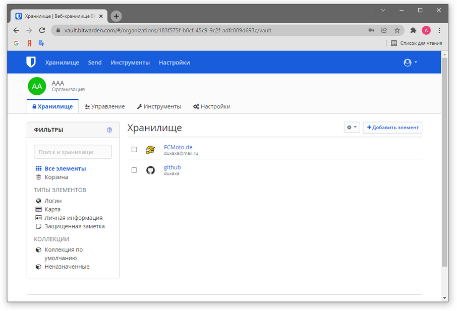
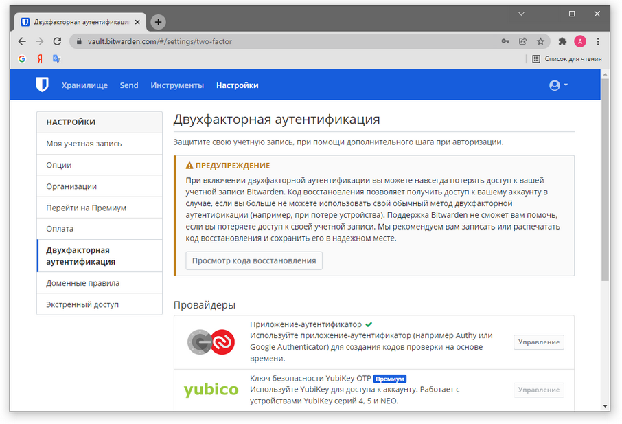
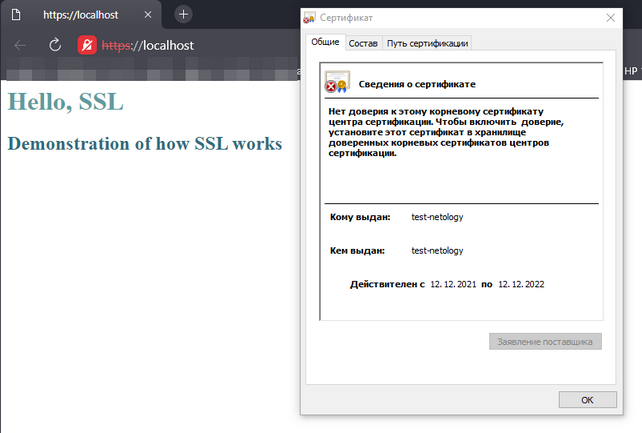
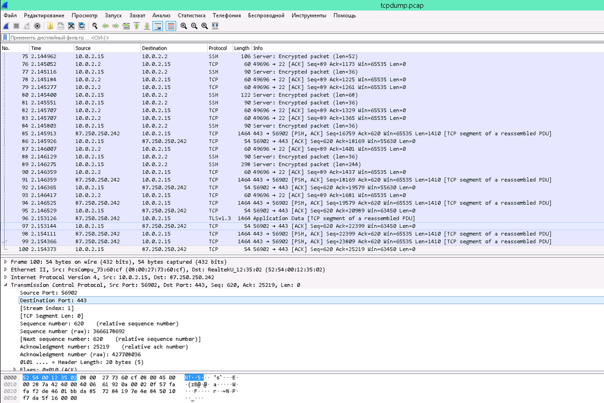

### 1. Установите Bitwarden плагин для браузера. Зарегистрируйтесь и сохраните несколько паролей.  


### 2. Установите Google authenticator на мобильный телефон. Настройте вход в Bitwarden акаунт через Google authenticator OTP.  
Скриншот только с PC. Android при попытке снятия скриншота делает черный снимок экрана без данных, т.к. Google Authenticator
приложение с конфиденциальными данными (пасскоды к приложениям).
  

### 3. Установите apache2, сгенерируйте самоподписанный сертификат, настройте тестовый сайт для работы по HTTPS.
Установка apache2:  
```shell
root@test-netology:~#
 apt install apache2
```
Включаем ssl-модуль:
```shell
# a2enmod  is  a  script that enables the specified module within the apache2 configuration.
root@test-netology:~#
 a2enmod ssl
Considering dependency setenvif for ssl:
Module setenvif already enabled
Considering dependency mime for ssl:
Module mime already enabled
Considering dependency socache_shmcb for ssl:
Enabling module socache_shmcb.
Enabling module ssl.
See /usr/share/doc/apache2/README.Debian.gz on how to configure SSL and create self-signed certificates.
To activate the new configuration, you need to run:
  systemctl restart apache2

root@test-netology:~#
 systemctl restart apache2
```  
Создаем сертификат и закрытый ключ:
```shell
 openssl \
> req -x509 \
> -nodes \
> -days 365 \
> -newkey rsa:2048 \
> -keyout /etc/ssl/private/apache-selfsigned.key \
> -out /etc/ssl/certs/apache-selfsigned.crt \
> -subj "/C=RU/ST=Moscow/L=Moscow/O=Company Name/OU=test-netology/CN=test-netology"
Generating a RSA private key
.....+++++
.............................+++++
writing new private key to '/etc/ssl/private/apache-selfsigned.key'
-----
```
Создаем конфиг сайта:
```shell
vim /etc/apache2/sites-available/test-netology.conf

<VirtualHost *:443>
ServerName test-netology
DocumentRoot /var/www/test-netology
SSLEngine on
SSLCertificateFile /etc/ssl/certs/apache-selfsigned.crt
SSLCertificateKeyFile /etc/ssl/private/apache-selfsigned.key
</VirtualHost>
```
Создаем каталог под ресурсы сайта:
```shell
mkdir /var/www/test-netology
```
Создаем страницу сайта:
```shell
vi /var/www/test-netology/index.html

<h1 style="color: #5e9ca0;">Hello, SSL</h1>
<h2 style="color: #2e6c80;">Demonstration of how SSL works</h2>
```
Включаем сайт:
```shell
# a2ensite, a2dissite - enable or disable an apache2 site / virtual host

root@test-netology:~#
 a2ensite test-netology.conf
Enabling site test-netology.
To activate the new configuration, you need to run:
  systemctl reload apache2

root@test-netology:/etc/apache2/sites-available#
 systemctl reload apache2
```
Проверяем, что сайт доступен по порту :443 (SSL):
```shell
root@test-netology:~#
 wget https://test-netology:443/index.html
--2021-12-12 13:55:10--  https://test-netology/index.html
Resolving test-netology (test-netology)... 127.0.2.1
Connecting to test-netology (test-netology)|127.0.2.1|:443... connected.
ERROR: cannot verify test-netology's certificate, issued by ‘CN=test-netology,OU=test-netology,O=Company Name,L=Moscow,ST=Moscow,C=RU’:
  Self-signed certificate encountered.
To connect to test-netology insecurely, use `--no-check-certificate'.

root@test-netology:~#
 ll
total 0

root@test-netology:~#
 wget --no-check-certificate https://test-netology:443/index.html
--2021-12-12 13:55:23--  https://test-netology/index.html
Resolving test-netology (test-netology)... 127.0.2.1
Connecting to test-netology (test-netology)|127.0.2.1|:443... connected.
WARNING: cannot verify test-netology's certificate, issued by ‘CN=test-netology,OU=test-netology,O=Company Name,L=Moscow,ST=Moscow,C=RU’:
  Self-signed certificate encountered.
HTTP request sent, awaiting response... 200 OK
Length: 108 [text/html]
Saving to: ‘index.html’

index.html               100%[==================================>]     108  --.-KB/s    in 0s      

2021-12-12 13:55:23 (17.5 MB/s) - ‘index.html’ saved [108/108]


root@test-netology:~#
 cat index.html 
<h1 style="color: #5e9ca0;">Hello, SSL</h1>
<h2 style="color: #2e6c80;">Demonstration of how SSL works</h2>
```
Проверяем доступность сайта в браузере на хостовой машине (в vagrant настроен проброс портов `config.vm.network "forwarded_port", guest: 443, host: 443`):  
  

### 4. Проверьте на TLS уязвимости произвольный сайт в интернете  
Клонируем проект:
```shell
vagrant@test-netology:~/aaa$
 git clone --depth 1 https://github.com/drwetter/testssl.sh.git

agrant@test-netology:~/aaa/testssl.sh$
 ./testssl.sh netology.ru 
```
[Результат проверки](testssl.output)

### 5. Установите на Ubuntu ssh сервер, сгенерируйте новый приватный ключ. Скопируйте свой публичный ключ на другой сервер. Подключитесь к серверу по SSH-ключу.
### 6. Переименуйте файлы ключей из задания 5. Настройте файл конфигурации SSH клиента, так чтобы вход на удаленный сервер осуществлялся по имени сервера.
Есть два ранее сгенерированных ключа: один для рабочих серверов, второй для подключения к личному репозиторию на github по ssh. 
`~/.ssh/config` уже настроен таким образом, чтобы подключение к github.com выполнялось с ключом `~/.ssh/id_rsa_github.pub`. 
Подключение к удаленному репозиторию github настроено по `ssh`, а не `https://`:  
```shell
duxaxa@kubuntu-vm:~/.ssh$
 ll
итого 32
drwx------  2 duxaxa duxaxa 4096 ноя  6 18:43 ./
drwxr-xr-x 22 duxaxa duxaxa 4096 дек 15 19:48 ../
-rw-rw-r--  1 duxaxa duxaxa   52 ноя  6 18:14 config
-rw-------  1 duxaxa duxaxa 1831 окт  5 12:49 id_rsa
-rw-------  1 duxaxa duxaxa 1676 ноя  6 18:12 id_rsa_github
-rw-r--r--  1 duxaxa duxaxa  381 ноя  6 18:42 id_rsa_github.pub
-rw-r--r--  1 duxaxa duxaxa  403 окт  5 12:49 id_rsa.pub
-rw-r--r--  1 duxaxa duxaxa 1770 ноя  6 18:14 known_hosts
duxaxa@kubuntu-vm:~/.ssh$
 cat config
Host github.com
	 IdentityFile ~/.ssh/id_rsa_github
duxaxa@kubuntu-vm:~/.ssh$
 cd ../devops-netology/
duxaxa@kubuntu-vm:~/devops-netology$
 git remote -v
origin	git@github.com:duxaxa/devops-netology.git (fetch)
origin	git@github.com:duxaxa/devops-netology.git (push)
duxaxa@kubuntu-vm:~/devops-netology$
 git pull
remote: Enumerating objects: 83, done.
remote: Counting objects: 100% (83/83), done.
remote: Compressing objects: 100% (61/61), done.
remote: Total 82 (delta 24), reused 68 (delta 13), pack-reused 0
Распаковка объектов: 100% (82/82), 2.72 МиБ | 1.14 МиБ/с, готово.
Из github.com:duxaxa/devops-netology
   0867622..dbc432f  main       -> origin/main
...

duxaxa@kubuntu-vm:~/devops-netology$
 mv ../.ssh/id_rsa_github ../.ssh/id_rsa_github1
duxaxa@kubuntu-vm:~/devops-netology$
 git pull
no such identity: /home/duxaxa/.ssh/id_rsa_github: No such file or directory
git@github.com: Permission denied (publickey).
fatal: Не удалось прочитать из внешнего репозитория.

Удостоверьтесь, что у вас есть необходимые права доступа
и репозиторий существует.
duxaxa@kubuntu-vm:~/devops-netology$
 mv ../.ssh/id_rsa_github1 ../.ssh/id_rsa_github
duxaxa@kubuntu-vm:~/devops-netology$
 git pull
Уже обновлено.
```

### 7. Соберите дамп трафика утилитой tcpdump в формате pcap, 100 пакетов. Откройте файл pcap в Wireshark. 
```shell
root@test-netology:~#
 tcpdump -c 100 -w tcpdump.pcap &
[1] 78339

root@test-netology:~#
 tcpdump: listening on eth0, link-type EN10MB (Ethernet), capture size 262144 bytes
wget https://ya.ru
--2021-12-15 17:31:50--  https://ya.ru/
Resolving ya.ru (ya.ru)... 87.250.250.242, 2a02:6b8::2:242
Connecting to ya.ru (ya.ru)|87.250.250.242|:443... connected.
HTTP request sent, awaiting response... 200 Ok
Length: 60754 (59K) [text/html]
Saving to: ‘index.html’

index.html                                        100%[=============================================================================================================>]  59.33K  --.-KB/s    in 0.02s   

2021-12-15 17:31:50 (2.38 MB/s) - ‘index.html’ saved [60754/60754]


root@test-netology:~#
 100 packets captured
165 packets received by filter
0 packets dropped by kernel

[1]+  Done                    tcpdump -c 100 -w tcpdump.pcap

root@test-netology:~#
 mv tcpdump.pcap /vagrant/
```

