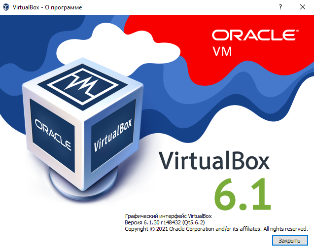

### Задача 1  
#### Опишите своими словами основные преимущества применения на практике IaaC паттернов.  
- Быстрое развертывание инфраструктуры на основе шаблона, описанного в виде кода  
- Многократное повторное использование шаблона для развертывания множества сервисов  
- Сведение к минимуму ошибок, которые могли бы возникнуть, если бы операции по развертыванию инфраструктуры 
выполнялось человеком  
- Шаблон развертывания, описанный в виде кода, сам по себе может являться документаций. При хранении шаблона в 
системах контроля версий, появляется возможность сравнивать изменения в разных версих шаблона.  
- Состояние инфраструктуры всегда соответствует параметрам, описанным в шаблоне
- Быстрое восстановление при сбое на основании подготовленных шаблонов  
#### Какой из принципов IaaC является основополагающим?  
Основополагающий принцип IaaC "все есть код". Вся инфраструктура описывается в виде кода, который выполняется 
специальными инструментами, и исключает ручную конфигурацию инфраструктуры.  

### Задача 2  
#### Чем Ansible выгодно отличается от других систем управление конфигурациями?  
- Доступ к серверам для распространения конфигураций выполняется по ssh 
- Не требуется установка агентов на управляемых серверах, это ускоряет время использования Ansible  
- Шаблоны декларативно описываются на языке YAML, т.о. не требуется знание каких-либо языков программирования  
- Большое количество подключаемых модулей, а так же возможность написания собственных модулей для расширения функционала  
- Можно использовать на всех этапах управления инфраструктурой: для создания инфраструктуры, для изменения конфигурации инфраструктуры  
- Можно использовать на всех этапах управления приложениями: деплой, старт\стоп 
#### Какой, на ваш взгляд, метод работы систем конфигурации более надёжный push или pull?  
Считаю Push более надежным методом, т.к. все действия по отправке конфигураций выполняются централизованно с сервера. 
Результат выполнения Push (успешно\неуспешно) сразу видно на сервере. В случае с Pull проблему можно заметить не сразу, 
если какой-то сервера не смог получить конфигурацию.  


### Задача 3
#### Установить на личный компьютер:
- VirtualBox  

- Vagrant
```
Windows PowerShell
(C) Корпорация Майкрософт (Microsoft Corporation). Все права защищены.

Попробуйте новую кроссплатформенную оболочку PowerShell (https://aka.ms/pscore6)

PS C:\Users\duxaxa> vagrant -v
Vagrant 2.2.19
```
- Ansible (установлен на гостевой ВМ)
```shell
root@test-netology:~#
 ansible --version
ansible 2.9.6
  config file = /etc/ansible/ansible.cfg
  configured module search path = ['/root/.ansible/plugins/modules', '/usr/share/ansible/plugins/modules']
  ansible python module location = /usr/lib/python3/dist-packages/ansible
  executable location = /usr/bin/ansible
  python version = 3.8.10 (default, Jun  2 2021, 10:49:15) [GCC 9.4.0]
```