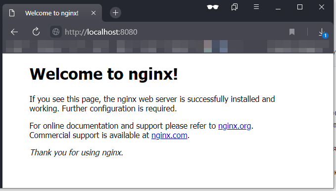
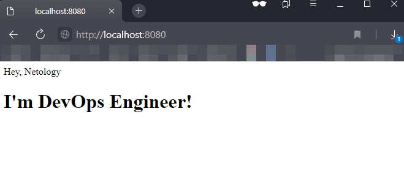

### Задача 1
Установлен Docker Engine на Ubuntu 20.04 по мануалу https://docs.docker.com/engine/install/ubuntu/#install-using-the-repository  
Проверка, что Docker работает:  
<details>
  <summary>docker run hello-world</summary>
  
```shell
vagrant@test-netology:~$
 sudo docker run hello-world
Unable to find image 'hello-world:latest' locally
latest: Pulling from library/hello-world
2db29710123e: Pull complete 
Digest: sha256:507ecde44b8eb741278274653120c2bf793b174c06ff4eaa672b713b3263477b
Status: Downloaded newer image for hello-world:latest

Hello from Docker!
This message shows that your installation appears to be working correctly.

To generate this message, Docker took the following steps:
 1. The Docker client contacted the Docker daemon.
 2. The Docker daemon pulled the "hello-world" image from the Docker Hub.
    (amd64)
 3. The Docker daemon created a new container from that image which runs the
    executable that produces the output you are currently reading.
 4. The Docker daemon streamed that output to the Docker client, which sent it
    to your terminal.

To try something more ambitious, you can run an Ubuntu container with:
 $ docker run -it ubuntu bash

Share images, automate workflows, and more with a free Docker ID:
 https://hub.docker.com/

For more examples and ideas, visit:
 https://docs.docker.com/get-started/
```
  
</details>

За основу возьмем образ nginx:1.20.2 (не дефолтный latest) https://hub.docker.com/_/nginx:  
  
```shell
vagrant@test-netology:~$
 sudo docker pull nginx:1.20.2
1.20.2: Pulling from library/nginx
5eb5b503b376: Pull complete 
cdfeb356c029: Pull complete 
d86da7454448: Pull complete 
7976249980ef: Pull complete 
8f66aa6726b2: Pull complete 
c004cabebe76: Pull complete 
Digest: sha256:02923d65cde08a49380ab3f3dd2f8f90aa51fa2bd358bd85f89345848f6e6623
Status: Downloaded newer image for nginx:1.20.2
docker.io/library/nginx:1.20.2
```

Запускаем контейнер:  
```shell
-d запустить в фоне  
-p проброс 80 порта контейнера на 8080 порт хоста. \
хост для докера фактически тоже ВМ, в конфиге Vagrant тоже настроен проброс: \
"config.vm.network "forwarded_port", guest: 8080, host: 8080" 
--name определяем имя контейнера


vagrant@test-netology:~$
 sudo docker run -d -p 8080:80 --name nginx nginx:1.20.2
635b43107502033347b7453651211bbfd4e8e7046ec9798cfba21c9bf257cf42

vagrant@test-netology:~$
 sudo docker container ls
CONTAINER ID   IMAGE          COMMAND                  CREATED          STATUS          PORTS                                   NAMES
635b43107502   nginx:1.20.2   "/docker-entrypoint.…"   47 seconds ago   Up 45 seconds   0.0.0.0:8080->80/tcp, :::8080->80/tcp   nginx
```

Проверяем, что nginx из контейнера доступен на хостовой (baremetal) машине:  
  

Приступаем к изменениям nginx внутри контейнера, чтобы отображалась страница:
```html
<html>
    <head>
        Hey, Netology
    </head>
    <body>
        <h1>I'm DevOps Engineer!</h1>
    </body>
</html>
```

Задачу можно решить несколькими способами

#### Способ 1 (с помощью Dockerfile):  

Создаем каталог, в котором будем собирать свой образ. В каталоге не должно быть ничего лишнего, кроме Dockerfile и заменяемой страницы index.html:  
```shell
vagrant@test-netology:~$
 mkdir -p /home/vagrant/docker-build && cd /home/vagrant/docker-build
```

Создаем на хостовой машине файл html-страницы:
```shell
vagrant@test-netology:~/docker-build$
 cat > index.html <<EOF
<html>
    <head>
        Hey, Netology
    </head>
    <body>
        <h1>I'm DevOps Engineer!</h1>
    </body>
</html>
```

Создаем на хостовой машине [Dockerfile](src/task1/Dockerfile):
```dockerfile
FROM nginx:1.20.2
COPY index.html /usr/share/nginx/html
```

Выполняем сборку нового образа:
```shell
vagrant@test-netology:~/docker-build$
 sudo docker build -t duxaxa/nginx:v1 .
Sending build context to Docker daemon  3.072kB
Step 1/2 : FROM nginx:1.20.2
 ---> d6c9558ba445
Step 2/2 : COPY index.html /usr/share/nginx/html
 ---> 5900f4ab11c4
Successfully built 5900f4ab11c4
Successfully tagged duxaxa/nginx:v1
```

Проверяем, что локально появился новый образ:
```shell
vagrant@test-netology:~/docker-build$
 sudo docker image ls
REPOSITORY     TAG       IMAGE ID       CREATED         SIZE
duxaxa/nginx   v1        5900f4ab11c4   5 minutes ago   141MB
nginx          1.20.2    d6c9558ba445   6 days ago      141MB
```

Останавливаем и удаляем исходный контейнер с nginx:1.20.2:
```shell
vagrant@test-netology:~/docker-build$
 sudo docker container stop nginx && sudo docker container rm nginx && sudo docker container ls -a
nginx
nginx
CONTAINER ID   IMAGE     COMMAND   CREATED   STATUS    PORTS     NAMES
```

Запускаем новый контейнер из нового образа:
```shell
vagrant@test-netology:~/docker-build$
 sudo docker run -d -p 8080:80 --name nginx duxaxa/nginx:v1
91ccf1f5f81b358d56ae2de141533839b328027c96d9730eca063ee87d89441b


vagrant@test-netology:~/docker-build$
 sudo docker container ls
CONTAINER ID   IMAGE           COMMAND                  CREATED          STATUS          PORTS                                   NAMES
91ccf1f5f81b   duxaxa/nginx:v1   "/docker-entrypoint.…"   20 seconds ago   Up 20 seconds   0.0.0.0:8080->80/tcp, :::8080->80/tcp   nginx
```

Проверяем, что nginx из контейнера доступен на хостовой (baremetal) машине и отображается новая страница index.html:  


Отправляем новый образ на DockerHub:
```shell
vagrant@test-netology:~/docker-build$
 sudo docker login -u duxaxa
Password: 
WARNING! Your password will be stored unencrypted in /root/.docker/config.json.
Configure a credential helper to remove this warning. See
https://docs.docker.com/engine/reference/commandline/login/#credentials-store

Login Succeeded

vagrant@test-netology:~/docker-build$
 sudo docker push duxaxa/nginx:v1
The push refers to repository [docker.io/duxaxa/nginx]
96257c5d0f59: Pushed 
b1073b41766d: Mounted from library/nginx 
8fa2ccbce0c2: Mounted from library/nginx 
dc78c3d0e917: Mounted from library/nginx 
a64a30dea1c4: Mounted from library/nginx 
f7d96e665ae1: Mounted from library/nginx 
7d0ebbe3f5d2: Mounted from library/nginx 
v1: digest: sha256:47f04d899e2db657ea46841dda4316afc28c1ca3c5ed92bedb0358073bd4a70b size: 1777
```

Ссылка на новый образ: https://hub.docker.com/r/duxaxa/nginx 


#### Способ 2 (меняем содержимое работающего контейнера и коммитим изменения в новый образ):  

Запускаем исходный образ:
```shell
vagrant@test-netology:~/docker-build$
 sudo docker run -d -p 8080:80 --name nginx nginx:1.20.2
dbd58fbe2ca1cabe38d401112d0c5ee2f11f3dd2bda3225aa6ce9359764293eb
```

Подключаемся к командной оболочке работающего контейнера и меняем содержимое станицы index.html:
```shell
vagrant@test-netology:~/docker-build$
 sudo docker exec -it nginx bash
root@dbd58fbe2ca1:/# cd /usr/share/nginx/html/
root@dbd58fbe2ca1:/usr/share/nginx/html# cat > index.html <<EOF
> <html>
>     <head>
>         Hey, Netology
>     </head>
>     <body>
>         <h1>I'm DevOps Engineer!</h1>
>         <h2>I'm DevOps Engineer again!</h1>
>     </body>
> </html>

root@dbd58fbe2ca1:/usr/share/nginx/html# exit
exit
```

Сохраняем измененное состояние контейнера, запущенного из исходного образа, в новый образ:
```shell
vagrant@test-netology:~/docker-build$
 sudo docker container commit nginx duxaxa/nginx:v2
sha256:9c5ac88f2f488bedb6b40126c74fc5e29bc878f43d2d0d8e4e74f560b13de487

vagrant@test-netology:~/docker-build$
 sudo docker image ls
REPOSITORY     TAG       IMAGE ID       CREATED          SIZE
duxaxa/nginx   v2        9c5ac88f2f48   12 seconds ago   141MB
duxaxa/nginx   v1        5900f4ab11c4   34 minutes ago   141MB
nginx 
```

Отправляем новый образ на DockerHub:
```shell
vagrant@test-netology:~/docker-build$
 sudo docker login -u duxaxa
Password: 
WARNING! Your password will be stored unencrypted in /root/.docker/config.json.
Configure a credential helper to remove this warning. See
https://docs.docker.com/engine/reference/commandline/login/#credentials-store

Login Succeeded

vagrant@test-netology:~/docker-build$
 sudo docker push duxaxa/nginx:v2
The push refers to repository [docker.io/duxaxa/nginx]
b270c7cd6a22: Pushed 
b1073b41766d: Layer already exists 
8fa2ccbce0c2: Layer already exists 
dc78c3d0e917: Layer already exists 
a64a30dea1c4: Layer already exists 
f7d96e665ae1: Layer already exists 
7d0ebbe3f5d2: Layer already exists 
v2: digest: sha256:813d010c21be9cf9c17553d8af6e535c4597fd50b76b0d2ab90b247911566fcf size: 1778
```

В результате по ссылке https://hub.docker.com/r/duxaxa/nginx/tags доступно 2 образа с тегами v1 и v2.


### Задача 2  
Посмотрите на сценарий ниже и ответьте на вопрос: "Подходит ли в этом сценарии использование Docker контейнеров или 
лучше подойдет виртуальная машина, физическая машина? Может быть возможны разные варианты?"
Детально опишите и обоснуйте свой выбор.
- **Высоконагруженное монолитное java веб-приложение;** Предпочтительнее использовать ВМ или физический сервер, т.к. это 
упростит диагностику и отладку JVM при возникновении проблем. Например, сделать снимок памяти JVM или пула потоков 
(треддамп) в контейнере будет затруднительнее. Использование Docker контейнеров возможно, но при условии, что
приложение супер стабильное и не потребует отладки; а так же в случае, если такое приложение не требует активно использовать
диски для записи и сохранения данных.  
- **Node.js веб-приложение;** Подходит использование контейнеров, т.к. как правило такое приложение акцентируется на 
обработке запросов в памяти, не требует активного использования дисковой подсистемы.  
- **Мобильное приложение c версиями для Android и iOS;** Подходит использование контейнера для процесса разработки и 
отладки и сборки приложений, т.к. решается проблема использования разных зависимостей в одном подготовленном контейнере 
(SDK, вспомогательный утилиты и т.д.).  
- **Шина данных на базе Apache Kafka;** Предпочтительнее использовать ВМ или физический сервер, т.к. журналы (топики) 
Kafka хранятся на файловой системе, происходит активное чтение.запись дисковой подсистемф. Потеря данных в топиках, как
правило, не допустима. Т.о. контейнеризация не подходит для данного сценария.  
- **Elasticsearch кластер для реализации логирования продуктивного веб-приложения - три ноды elasticsearch, два logstash и две ноды kibana;**  
По официальным мануалам, все 3 компонента можно развернуть в контейнерах. Но в случае, когда Logstash принимает на 
вход данные в виде файловых логов, а не через tcp-сокет, возможно лучше использовать ВМ или физический сервер.  
- **Мониторинг-стек на базе Prometheus и Grafana;** По официальным мануалам, все 2 компонента можно развернуть в 
контейнерах. Grafana, как средство визуализации данных, можно использовать в контейнере. В случае, если Prometheus 
собирает метрики с очень большого количества узлов, возможно предпочтительнее использовать ВМ или физический сервер.  
- **MongoDB, как основное хранилище данных для java-приложения;** Подходит для использования в контейнере, т.к. является
NoSQL базой данных. Вендором рекомендуется использование Docker контейнера только для среду разработки. Для промышленного
использования рекомендуется использовать Kubernetes.  
- **Gitlab сервер для реализации CI/CD процессов и приватный (закрытый) Docker Registry;** Отлично контейнеризуется из 
коробки, как сервер Gitlab, так и Runner'ы. Использование образов Docker для выполнения сборок обеспечивает всегда 
одно и тоже окружение.


### Задача 3

Скачиваем образы `centos` и `docker`:  
```shell
vagrant@test-netology:~/debian$
 sudo docker pull centos && sudo docker pull debian
```

Если пытаться запустить контейнеры из образов в фоне, то контейнеры сразу завершают работу:
```shell
vagrant@test-netology:~/debian$
 sudo docker run -d centos
e8950b5a65f9589d4f140576c4ead40fc4b1d6e170e925c04a1a94912fee0398

vagrant@test-netology:~/debian$
 sudo docker container ls -a
CONTAINER ID   IMAGE     COMMAND       CREATED          STATUS                     PORTS     NAMES
e8950b5a65f9   centos    "/bin/bash"   13 seconds ago   Exited (0) 8 seconds ago             beautiful_williams

vagrant@test-netology:~/debian$
 sudo docker exec -it e8950b5a65f9 bash
Error response from daemon: Container e8950b5a65f9589d4f140576c4ead40fc4b1d6e170e925c04a1a94912fee0398 is not running
```

Если посмотреть лог `journalctl -xe`, то видно ошибки:

<details>
  <summary>При попытке старта образа centos возникла ошибка</summary>

```shell
Feb 01 18:22:40 test-netology systemd[1]: var-lib-docker-overlay2-dc5aca292a6e09dad837a27f4ecc476932583614bf33ddfe60319f9cfd812db2\x2dinit-merged.mount: Succeeded.
-- Subject: Unit succeeded
-- Defined-By: systemd
-- Support: http://www.ubuntu.com/support
-- 
-- The unit var-lib-docker-overlay2-dc5aca292a6e09dad837a27f4ecc476932583614bf33ddfe60319f9cfd812db2\x2dinit-merged.mount has successfully entered the 'dead' state.
Feb 01 18:22:40 test-netology systemd[1]: var-lib-docker-overlay2-dc5aca292a6e09dad837a27f4ecc476932583614bf33ddfe60319f9cfd812db2-merged.mount: Succeeded.
-- Subject: Unit succeeded
-- Defined-By: systemd
-- Support: http://www.ubuntu.com/support
-- 
-- The unit var-lib-docker-overlay2-dc5aca292a6e09dad837a27f4ecc476932583614bf33ddfe60319f9cfd812db2-merged.mount has successfully entered the 'dead' state.
Feb 01 18:22:40 test-netology networkd-dispatcher[744]: WARNING:Unknown index 63 seen, reloading interface list
Feb 01 18:22:40 test-netology systemd-udevd[8863]: ethtool: autonegotiation is unset or enabled, the speed and duplex are not writable.
Feb 01 18:22:40 test-netology systemd-udevd[8863]: Using default interface naming scheme 'v245'.
Feb 01 18:22:40 test-netology systemd-udevd[8863]: veth52cee47: Could not generate persistent MAC: No data available
Feb 01 18:22:40 test-netology kernel: docker0: port 1(veth52cee47) entered blocking state
Feb 01 18:22:40 test-netology kernel: docker0: port 1(veth52cee47) entered disabled state
Feb 01 18:22:40 test-netology kernel: device veth52cee47 entered promiscuous mode
Feb 01 18:22:40 test-netology systemd-udevd[8861]: ethtool: autonegotiation is unset or enabled, the speed and duplex are not writable.
Feb 01 18:22:40 test-netology systemd-udevd[8861]: Using default interface naming scheme 'v245'.
Feb 01 18:22:40 test-netology systemd-udevd[8861]: vethd1c94e6: Could not generate persistent MAC: No data available
Feb 01 18:22:40 test-netology systemd-networkd[434]: veth52cee47: Link UP
Feb 01 18:22:40 test-netology containerd[893]: time="2022-02-01T18:22:40.379882865Z" level=info msg="starting signal loop" namespace=moby path=/run/containerd/io.containerd.runtim>
Feb 01 18:22:40 test-netology systemd[1]: run-docker-runtime\x2drunc-moby-eb75af43de5388761808db3d959d5353b9311493888e442d8db7064e2d965930-runc.qJ7GPj.mount: Succeeded.
-- Subject: Unit succeeded
-- Defined-By: systemd
-- Support: http://www.ubuntu.com/support
-- 
-- The unit run-docker-runtime\x2drunc-moby-eb75af43de5388761808db3d959d5353b9311493888e442d8db7064e2d965930-runc.qJ7GPj.mount has successfully entered the 'dead' state.
Feb 01 18:22:40 test-netology systemd[1497]: run-docker-runtime\x2drunc-moby-eb75af43de5388761808db3d959d5353b9311493888e442d8db7064e2d965930-runc.qJ7GPj.mount: Succeeded.
-- Subject: Unit succeeded
-- Defined-By: systemd
-- Support: http://www.ubuntu.com/support
-- 
-- The unit UNIT has successfully entered the 'dead' state.
Feb 01 18:22:40 test-netology systemd-networkd[434]: veth52cee47: Gained carrier
Feb 01 18:22:40 test-netology systemd-networkd[434]: docker0: Gained carrier
Feb 01 18:22:40 test-netology kernel: eth0: renamed from vethd1c94e6
Feb 01 18:22:40 test-netology kernel: IPv6: ADDRCONF(NETDEV_CHANGE): veth52cee47: link becomes ready
Feb 01 18:22:40 test-netology kernel: docker0: port 1(veth52cee47) entered blocking state
Feb 01 18:22:40 test-netology kernel: docker0: port 1(veth52cee47) entered forwarding state
Feb 01 18:22:40 test-netology containerd[893]: time="2022-02-01T18:22:40.996915811Z" level=info msg="shim disconnected" id=eb75af43de5388761808db3d959d5353b9311493888e442d8db7064e>
Feb 01 18:22:40 test-netology containerd[893]: time="2022-02-01T18:22:40.996958681Z" level=error msg="copy shim log" error="read /proc/self/fd/12: file already closed"
Feb 01 18:22:40 test-netology dockerd[1191]: time="2022-02-01T18:22:40.997742522Z" level=info msg="ignoring event" container=eb75af43de5388761808db3d959d5353b9311493888e442d8db706>
Feb 01 18:22:41 test-netology systemd-networkd[434]: veth52cee47: Lost carrier
Feb 01 18:22:41 test-netology kernel: docker0: port 1(veth52cee47) entered disabled state
Feb 01 18:22:41 test-netology kernel: vethd1c94e6: renamed from eth0
Feb 01 18:22:41 test-netology networkd-dispatcher[744]: WARNING:Unknown index 63 seen, reloading interface list
Feb 01 18:22:41 test-netology systemd-udevd[8930]: ethtool: autonegotiation is unset or enabled, the speed and duplex are not writable.
Feb 01 18:22:41 test-netology systemd-udevd[8930]: Using default interface naming scheme 'v245'.
Feb 01 18:22:41 test-netology lldpd[945]: removal request for address of fe80::27:7eff:fe04:7c30%64, but no knowledge of it
Feb 01 18:22:41 test-netology systemd-networkd[434]: veth52cee47: Link DOWN
Feb 01 18:22:41 test-netology systemd-networkd[434]: rtnl: received neighbor for link '64' we don't know about, ignoring.
Feb 01 18:22:41 test-netology kernel: docker0: port 1(veth52cee47) entered disabled state
Feb 01 18:22:41 test-netology kernel: device veth52cee47 left promiscuous mode
Feb 01 18:22:41 test-netology kernel: docker0: port 1(veth52cee47) entered disabled state
Feb 01 18:22:41 test-netology systemd-networkd[434]: rtnl: received neighbor for link '64' we don't know about, ignoring.
Feb 01 18:22:41 test-netology systemd-udevd[8930]: vethd1c94e6: Failed to get link config: No such device
Feb 01 18:22:41 test-netology systemd[1497]: run-docker-netns-ae319e5094c3.mount: Succeeded.
-- Subject: Unit succeeded
-- Defined-By: systemd
-- Support: http://www.ubuntu.com/support
-- 
-- The unit UNIT has successfully entered the 'dead' state.
Feb 01 18:22:41 test-netology systemd[1]: run-docker-netns-ae319e5094c3.mount: Succeeded.
-- Subject: Unit succeeded
-- Defined-By: systemd
-- Support: http://www.ubuntu.com/support
-- 
-- The unit run-docker-netns-ae319e5094c3.mount has successfully entered the 'dead' state.
Feb 01 18:22:41 test-netology systemd[1497]: var-lib-docker-overlay2-dc5aca292a6e09dad837a27f4ecc476932583614bf33ddfe60319f9cfd812db2-merged.mount: Succeeded.
-- Subject: Unit succeeded
-- Defined-By: systemd
-- Support: http://www.ubuntu.com/support
-- 
-- The unit UNIT has successfully entered the 'dead' state.
Feb 01 18:22:41 test-netology systemd[1]: var-lib-docker-overlay2-dc5aca292a6e09dad837a27f4ecc476932583614bf33ddfe60319f9cfd812db2-merged.mount: Succeeded.
-- Subject: Unit succeeded
-- Defined-By: systemd
-- Support: http://www.ubuntu.com/support
-- 
-- The unit var-lib-docker-overlay2-dc5aca292a6e09dad837a27f4ecc476932583614bf33ddfe60319f9cfd812db2-merged.mount has successfully entered the 'dead' state.
Feb 01 18:22:41 test-netology systemd-networkd[434]: docker0: Lost carrier
```

</details>

Так происходит, т.к. в исходных образах в директиве `CMD` указана команда запуска командной оболочки. 
Т.е. оболочка запускается и сразу же закрывается, т.к. в контейнере нет устройства псевдотерминала:
```shell
vagrant@test-netology:~/debian$
 sudo docker inspect debian | grep CMD
                "CMD [\"bash\"]"

vagrant@test-netology:~/debian$
 sudo docker inspect centos | grep CMD
                "CMD [\"/bin/bash\"]"
```

Чтобы контейнер продолжил работу в фоне, следует запустить его с опцией `-t, --tty  Allocate a pseudo-TTY`:  
```shell
vagrant@test-netology:~/debian$
 sudo docker run -t -d centos
c506736777fb884227342d5274f1755dfe0c59ecddbf397f0d00dce5b4b22c38

vagrant@test-netology:~/debian$
 sudo docker exec -it c506736777fb884227342d5274f1755dfe0c59ecddbf397f0d00dce5b4b22c38 bash
[root@c506736777fb /]# uptime
 21:01:42 up  9:22,  0 users,  load average: 0.00, 0.00, 0.02
[root@c506736777fb /]# 
```

Либо можно внести изменения в образ, изменив значение в директиве `CMD` на `/usr/sbin/init`. Для этого 
создать [Dockerfile](src/task3/centos/Dockerfile):
```dockerfile
FROM centos:latest
CMD ["/usr/sbin/init"]CMD ["/usr/sbin/init"]
```

И собрать новый локальный образ с `centos`:
```shell
vagrant@test-netology:~/centos$
 sudo docker build -t local/centos .
Sending build context to Docker daemon  2.048kB
Step 1/2 : FROM centos:latest
 ---> 5d0da3dc9764
Step 2/2 : CMD ["/usr/sbin/init"]
 ---> Running in fdb77736392b
Removing intermediate container fdb77736392b
 ---> 710cf694a89c
Successfully built 710cf694a89c
Successfully tagged local/centos:latest
```

Аналогично пересобрать новый локальный образ с `debian`:
создать [Dockerfile](src/task3/debian/Dockerfile):
```dockerfile
FROM debian:latest
CMD ["/usr/sbin/init"]
```
```shell
vagrant@test-netology:~/debian$
 sudo docker build -t local/debian .
Sending build context to Docker daemon  2.048kB
Step 1/2 : FROM centos:latest
 ---> 5d0da3dc9764
Step 2/2 : CMD ["/usr/sbin/init"]
 ---> Using cache
 ---> 710cf694a89c
Successfully built 710cf694a89c
Successfully tagged local/debian:latest
```

Запускаем новые контейнеры из модифицированных образов `centos` и `debian`:
```shell
vagrant@test-netology:~/centos$
 sudo docker run -d --name centos -v /home/vagrant/data:/data local/centos
183ceb43839c4454d0e45753ce2df80c50b872bad37b38f19bc108253d20a11c

vagrant@test-netology:~/debian$
 sudo docker run -d --name debian -v /home/vagrant/data:/data local/debian
556de12ad40d8d5ad4bffa15a7edadcf274c3d668d3c00e68a7f138bc49e10d4

vagrant@test-netology:~/centos$
 sudo docker container ls
CONTAINER ID   IMAGE          COMMAND            CREATED          STATUS          PORTS     NAMES
556de12ad40d   local/debian   "/usr/sbin/init"   13 seconds ago   Up 11 seconds             debian
183ceb43839c   local/centos   "/usr/sbin/init"   5 minutes ago    Up 5 minutes              centos
```

Подключаемся к командной оболочке контейнера `centos`, проверяем что ФС `/data` смонтирована в контейнер, 
создаем тестовый файл в контейнере:
```shell
vagrant@test-netology:~/centos$
 sudo docker exec -it centos bash
[root@183ceb43839c /]# df -h /data
Filesystem                  Size  Used Avail Use% Mounted on
/dev/mapper/vgvagrant-root   62G  2.8G   56G   5% /data
[root@183ceb43839c /]# ls -l /data
total 0
[root@183ceb43839c /]# echo "Test file created on centos container" > /data/file
[root@183ceb43839c /]# md5sum /data/file
35cc31e14b7d7b054b770b712a0d78e2  /data/file
```

Выходим из командной оболочки контейнера, проверяем наличие файла, созданного в контейнере, 
создаем второй новый файл на хостовой ВМ:  
```shell
vagrant@test-netology:~/centos$
 md5sum ~/data/file 
35cc31e14b7d7b054b770b712a0d78e2  /home/vagrant/data/file

vagrant@test-netology:~/centos$
 echo "Test file created on host" > ~/data/file_new

vagrant@test-netology:~/centos$
 md5sum /home/vagrant/data/*
35cc31e14b7d7b054b770b712a0d78e2  /home/vagrant/data/file
d2ab408187c5c9d8c706f74922b3366b  /home/vagrant/data/file_new
```

Подключаемся к командной оболочке контейнера `debian`, проверяем что ФС `/data` смонтирована в контейнер, 
на ФС `/data` есть файлы, созданные в контейнере `centos` и на хосте:
```shell
vagrant@test-netology:~/centos$
 sudo docker exec -it debian bash
[root@556de12ad40d /]# ls -l /data
total 8
-rw-r--r-- 1 root root 38 Feb  1 21:19 file
-rw-rw-r-- 1 1000 1000 26 Feb  1 21:21 file_new
[root@556de12ad40d /]# md5sum /data/*
35cc31e14b7d7b054b770b712a0d78e2  /data/file
d2ab408187c5c9d8c706f74922b3366b  /data/file_new
```
