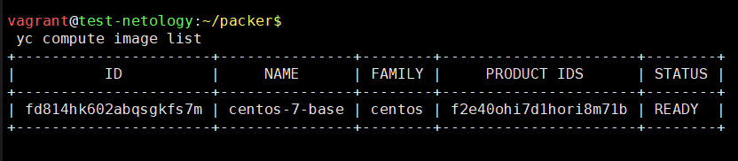
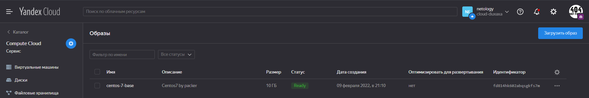
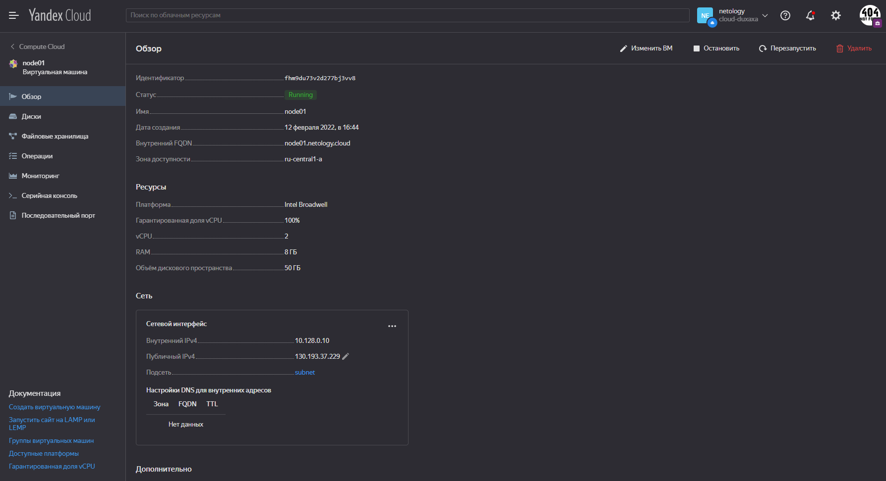
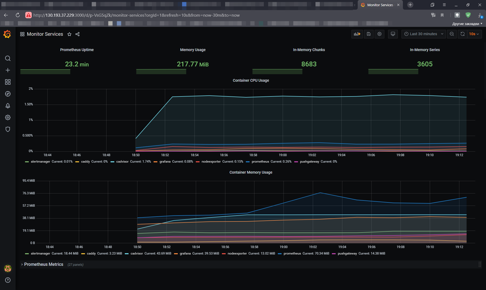

### Задача 1

[Инсталяция Packer (Yandex.Cloud)](https://cloud.yandex.ru/docs/solutions/infrastructure-management/packer-quickstart#install-packer)  
[Инсталяция Packer (HashiCorp)](https://learn.hashicorp.com/tutorials/packer/get-started-install-cli#precompiled-binaries)  

Конвертируем файл [centos-7-base.json](src/packer/centos-7-base.json) в формат `packer` версии `1.7.10`:  
```shell
vagrant@test-netology:~/packer$
 packer -v
1.7.10

vagrant@test-netology:~/packer$
 packer hcl2_upgrade -output-file=centos-7-base.pkr.hcl centos-7-base.json
Successfully created centos-7-base.pkr.hcl. Exit 0
```

Получили файл [centos-7-base.pkr.hcl](src/packer/centos-7-base.pkr.hcl).
Редактируем в файле идентификаторы `folder_id`, `token` и `subnet_id` на актуальные:  
```shell
vagrant@test-netology:~$
 yc config list
token: xxxxxxxxxxxxxxxxxxxxxx
cloud-id: b1g0jro5rhsgce2l9j2l
folder-id: b1gde371vpvsv5481k70
compute-default-zone: ru-central1-a

vagrant@test-netology:~$
 yc vpc network list
+----------------------+---------+
|          ID          |  NAME   |
+----------------------+---------+
| enpdg21usc71lf0n2ncq | default |
+----------------------+---------+

vagrant@test-netology:~$
 yc vpc subnets list
+----------------------+-----------------------+----------------------+----------------+---------------+-----------------+
|          ID          |         NAME          |      NETWORK ID      | ROUTE TABLE ID |     ZONE      |      RANGE      |
+----------------------+-----------------------+----------------------+----------------+---------------+-----------------+
| b0ci72arrmr32um3dfh4 | default-ru-central1-c | enpdg21usc71lf0n2ncq |                | ru-central1-c | [10.130.0.0/24] |
| e2l74aldeffsgf19eebn | default-ru-central1-b | enpdg21usc71lf0n2ncq |                | ru-central1-b | [10.129.0.0/24] |
| e9b4kp8t1aqntcfcbk6v | default-ru-central1-a | enpdg21usc71lf0n2ncq |                | ru-central1-a | [10.128.0.0/24] |
+----------------------+-----------------------+----------------------+----------------+---------------+-----------------+
```

Проверяем валидность файла:
```shell
vagrant@test-netology:~/packer$
 packer validate centos-7-base.pkr.hcl 
The configuration is valid.
```

Собираем образ:
<details>
    <summary>packer build centos-7-base.pkr.hcl</summary>

```shell
vagrant@test-netology:~/packer$
 packer build centos-7-base.pkr.hcl 
yandex.autogenerated_1: output will be in this color.

==> yandex.autogenerated_1: Creating temporary RSA SSH key for instance...
==> yandex.autogenerated_1: Using as source image: fd8gdnd09d0iqdu7ll2a (name: "centos-7-v20220207", family: "centos-7")
==> yandex.autogenerated_1: Use provided subnet id e9b4kp8t1aqntcfcbk6v
==> yandex.autogenerated_1: Creating disk...
==> yandex.autogenerated_1: Creating instance...
==> yandex.autogenerated_1: Waiting for instance with id fhm75jvmr9h3n0lcend1 to become active...
    yandex.autogenerated_1: Detected instance IP: 51.250.3.16
==> yandex.autogenerated_1: Using SSH communicator to connect: 51.250.3.16
==> yandex.autogenerated_1: Waiting for SSH to become available...
==> yandex.autogenerated_1: Connected to SSH!
==> yandex.autogenerated_1: Provisioning with shell script: /tmp/packer-shell2711286655
    yandex.autogenerated_1: Loaded plugins: fastestmirror
    yandex.autogenerated_1: Loading mirror speeds from cached hostfile
    yandex.autogenerated_1:  * base: mirrors.datahouse.ru
    yandex.autogenerated_1:  * extras: mirrors.datahouse.ru
    yandex.autogenerated_1:  * updates: mirror.sale-dedic.com
    yandex.autogenerated_1: No packages marked for update
    yandex.autogenerated_1: Loaded plugins: fastestmirror
    yandex.autogenerated_1: Loading mirror speeds from cached hostfile
    yandex.autogenerated_1:  * base: mirrors.datahouse.ru
    yandex.autogenerated_1:  * extras: mirrors.datahouse.ru
    yandex.autogenerated_1:  * updates: mirror.sale-dedic.com
    yandex.autogenerated_1: Package iptables-1.4.21-35.el7.x86_64 already installed and latest version
    yandex.autogenerated_1: Package curl-7.29.0-59.el7_9.1.x86_64 already installed and latest version
    yandex.autogenerated_1: Package net-tools-2.0-0.25.20131004git.el7.x86_64 already installed and latest version
    yandex.autogenerated_1: Package rsync-3.1.2-10.el7.x86_64 already installed and latest version
    yandex.autogenerated_1: Package openssh-server-7.4p1-22.el7_9.x86_64 already installed and latest version
    yandex.autogenerated_1: Resolving Dependencies
    yandex.autogenerated_1: --> Running transaction check
    yandex.autogenerated_1: ---> Package bind-utils.x86_64 32:9.11.4-26.P2.el7_9.8 will be installed
    yandex.autogenerated_1: --> Processing Dependency: bind-libs-lite(x86-64) = 32:9.11.4-26.P2.el7_9.8 for package: 32:bind-utils-9.11.4-26.P2.el7_9.8.x86_64
    yandex.autogenerated_1: --> Processing Dependency: bind-libs(x86-64) = 32:9.11.4-26.P2.el7_9.8 for package: 32:bind-utils-9.11.4-26.P2.el7_9.8.x86_64
    yandex.autogenerated_1: --> Processing Dependency: liblwres.so.160()(64bit) for package: 32:bind-utils-9.11.4-26.P2.el7_9.8.x86_64
    yandex.autogenerated_1: --> Processing Dependency: libisccfg.so.160()(64bit) for package: 32:bind-utils-9.11.4-26.P2.el7_9.8.x86_64
    yandex.autogenerated_1: --> Processing Dependency: libisc.so.169()(64bit) for package: 32:bind-utils-9.11.4-26.P2.el7_9.8.x86_64
    yandex.autogenerated_1: --> Processing Dependency: libirs.so.160()(64bit) for package: 32:bind-utils-9.11.4-26.P2.el7_9.8.x86_64
    yandex.autogenerated_1: --> Processing Dependency: libdns.so.1102()(64bit) for package: 32:bind-utils-9.11.4-26.P2.el7_9.8.x86_64
    yandex.autogenerated_1: --> Processing Dependency: libbind9.so.160()(64bit) for package: 32:bind-utils-9.11.4-26.P2.el7_9.8.x86_64
    yandex.autogenerated_1: --> Processing Dependency: libGeoIP.so.1()(64bit) for package: 32:bind-utils-9.11.4-26.P2.el7_9.8.x86_64
    yandex.autogenerated_1: ---> Package bridge-utils.x86_64 0:1.5-9.el7 will be installed
    yandex.autogenerated_1: ---> Package tcpdump.x86_64 14:4.9.2-4.el7_7.1 will be installed
    yandex.autogenerated_1: --> Processing Dependency: libpcap >= 14:1.5.3-10 for package: 14:tcpdump-4.9.2-4.el7_7.1.x86_64
    yandex.autogenerated_1: --> Processing Dependency: libpcap.so.1()(64bit) for package: 14:tcpdump-4.9.2-4.el7_7.1.x86_64
    yandex.autogenerated_1: ---> Package telnet.x86_64 1:0.17-66.el7 will be installed
    yandex.autogenerated_1: --> Running transaction check
    yandex.autogenerated_1: ---> Package GeoIP.x86_64 0:1.5.0-14.el7 will be installed
    yandex.autogenerated_1: --> Processing Dependency: geoipupdate for package: GeoIP-1.5.0-14.el7.x86_64
    yandex.autogenerated_1: ---> Package bind-libs.x86_64 32:9.11.4-26.P2.el7_9.8 will be installed
    yandex.autogenerated_1: --> Processing Dependency: bind-license = 32:9.11.4-26.P2.el7_9.8 for package: 32:bind-libs-9.11.4-26.P2.el7_9.8.x86_64
    yandex.autogenerated_1: ---> Package bind-libs-lite.x86_64 32:9.11.4-26.P2.el7_9.8 will be installed
    yandex.autogenerated_1: ---> Package libpcap.x86_64 14:1.5.3-12.el7 will be installed
    yandex.autogenerated_1: --> Running transaction check
    yandex.autogenerated_1: ---> Package bind-license.noarch 32:9.11.4-26.P2.el7_9.8 will be installed
    yandex.autogenerated_1: ---> Package geoipupdate.x86_64 0:2.5.0-1.el7 will be installed
    yandex.autogenerated_1: --> Finished Dependency Resolution
    yandex.autogenerated_1:
    yandex.autogenerated_1: Dependencies Resolved
    yandex.autogenerated_1:
    yandex.autogenerated_1: ================================================================================
    yandex.autogenerated_1:  Package            Arch       Version                        Repository   Size
    yandex.autogenerated_1: ================================================================================
    yandex.autogenerated_1: Installing:
    yandex.autogenerated_1:  bind-utils         x86_64     32:9.11.4-26.P2.el7_9.8        updates     261 k
    yandex.autogenerated_1:  bridge-utils       x86_64     1.5-9.el7                      base         32 k
    yandex.autogenerated_1:  tcpdump            x86_64     14:4.9.2-4.el7_7.1             base        422 k
    yandex.autogenerated_1:  telnet             x86_64     1:0.17-66.el7                  updates      64 k
    yandex.autogenerated_1: Installing for dependencies:
    yandex.autogenerated_1:  GeoIP              x86_64     1.5.0-14.el7                   base        1.5 M
    yandex.autogenerated_1:  bind-libs          x86_64     32:9.11.4-26.P2.el7_9.8        updates     157 k
    yandex.autogenerated_1:  bind-libs-lite     x86_64     32:9.11.4-26.P2.el7_9.8        updates     1.1 M
    yandex.autogenerated_1:  bind-license       noarch     32:9.11.4-26.P2.el7_9.8        updates      91 k
    yandex.autogenerated_1:  geoipupdate        x86_64     2.5.0-1.el7                    base         35 k
    yandex.autogenerated_1:  libpcap            x86_64     14:1.5.3-12.el7                base        139 k
    yandex.autogenerated_1:
    yandex.autogenerated_1: Transaction Summary
    yandex.autogenerated_1: ================================================================================
    yandex.autogenerated_1: Install  4 Packages (+6 Dependent packages)
    yandex.autogenerated_1:
    yandex.autogenerated_1: Total download size: 3.8 M
    yandex.autogenerated_1: Installed size: 9.0 M
    yandex.autogenerated_1: Downloading packages:
    yandex.autogenerated_1: --------------------------------------------------------------------------------
    yandex.autogenerated_1: Total                                              4.7 MB/s | 3.8 MB  00:00
    yandex.autogenerated_1: Running transaction check
    yandex.autogenerated_1: Running transaction test
    yandex.autogenerated_1: Transaction test succeeded
    yandex.autogenerated_1: Running transaction
    yandex.autogenerated_1:   Installing : 32:bind-license-9.11.4-26.P2.el7_9.8.noarch                 1/10
    yandex.autogenerated_1:   Installing : geoipupdate-2.5.0-1.el7.x86_64                              2/10
    yandex.autogenerated_1:   Installing : GeoIP-1.5.0-14.el7.x86_64                                   3/10
    yandex.autogenerated_1:   Installing : 32:bind-libs-lite-9.11.4-26.P2.el7_9.8.x86_64               4/10
    yandex.autogenerated_1:   Installing : 32:bind-libs-9.11.4-26.P2.el7_9.8.x86_64                    5/10
    yandex.autogenerated_1:   Installing : 14:libpcap-1.5.3-12.el7.x86_64                              6/10
    yandex.autogenerated_1: pam_tally2: Error opening /var/log/tallylog for update: Permission denied
    yandex.autogenerated_1: pam_tally2: Authentication error
    yandex.autogenerated_1: useradd: failed to reset the tallylog entry of user "tcpdump"
    yandex.autogenerated_1:   Installing : 14:tcpdump-4.9.2-4.el7_7.1.x86_64                           7/10
    yandex.autogenerated_1:   Installing : 32:bind-utils-9.11.4-26.P2.el7_9.8.x86_64                   8/10
    yandex.autogenerated_1:   Installing : bridge-utils-1.5-9.el7.x86_64                               9/10
    yandex.autogenerated_1:   Installing : 1:telnet-0.17-66.el7.x86_64                                10/10
    yandex.autogenerated_1:   Verifying  : GeoIP-1.5.0-14.el7.x86_64                                   1/10
    yandex.autogenerated_1:   Verifying  : 1:telnet-0.17-66.el7.x86_64                                 2/10
    yandex.autogenerated_1:   Verifying  : 14:libpcap-1.5.3-12.el7.x86_64                              3/10
    yandex.autogenerated_1:   Verifying  : geoipupdate-2.5.0-1.el7.x86_64                              4/10
    yandex.autogenerated_1:   Verifying  : 14:tcpdump-4.9.2-4.el7_7.1.x86_64                           5/10
    yandex.autogenerated_1:   Verifying  : 32:bind-license-9.11.4-26.P2.el7_9.8.noarch                 6/10
    yandex.autogenerated_1:   Verifying  : 32:bind-libs-lite-9.11.4-26.P2.el7_9.8.x86_64               7/10
    yandex.autogenerated_1:   Verifying  : 32:bind-utils-9.11.4-26.P2.el7_9.8.x86_64                   8/10
    yandex.autogenerated_1:   Verifying  : 32:bind-libs-9.11.4-26.P2.el7_9.8.x86_64                    9/10
    yandex.autogenerated_1:   Verifying  : bridge-utils-1.5-9.el7.x86_64                              10/10
    yandex.autogenerated_1:
    yandex.autogenerated_1: Installed:
    yandex.autogenerated_1:   bind-utils.x86_64 32:9.11.4-26.P2.el7_9.8   bridge-utils.x86_64 0:1.5-9.el7
    yandex.autogenerated_1:   tcpdump.x86_64 14:4.9.2-4.el7_7.1           telnet.x86_64 1:0.17-66.el7
    yandex.autogenerated_1:
    yandex.autogenerated_1: Dependency Installed:
    yandex.autogenerated_1:   GeoIP.x86_64 0:1.5.0-14.el7
    yandex.autogenerated_1:   bind-libs.x86_64 32:9.11.4-26.P2.el7_9.8
    yandex.autogenerated_1:   bind-libs-lite.x86_64 32:9.11.4-26.P2.el7_9.8
    yandex.autogenerated_1:   bind-license.noarch 32:9.11.4-26.P2.el7_9.8
    yandex.autogenerated_1:   geoipupdate.x86_64 0:2.5.0-1.el7
    yandex.autogenerated_1:   libpcap.x86_64 14:1.5.3-12.el7
    yandex.autogenerated_1:
    yandex.autogenerated_1: Complete!
==> yandex.autogenerated_1: Stopping instance...
==> yandex.autogenerated_1: Deleting instance...
    yandex.autogenerated_1: Instance has been deleted!
==> yandex.autogenerated_1: Creating image: centos-7-base
==> yandex.autogenerated_1: Waiting for image to complete...
==> yandex.autogenerated_1: Success image create...
==> yandex.autogenerated_1: Destroying boot disk...
    yandex.autogenerated_1: Disk has been deleted!
Build 'yandex.autogenerated_1' finished after 2 minutes 6 seconds.

==> Wait completed after 2 minutes 6 seconds

==> Builds finished. The artifacts of successful builds are:
--> yandex.autogenerated_1: A disk image was created: centos-7-base (id: fd814hk602abqsgkfs7m) with family name centos
```

</details>  

```shell
vagrant@test-netology:~/packer$
 yc compute image list
+----------------------+---------------+--------+----------------------+--------+
|          ID          |     NAME      | FAMILY |     PRODUCT IDS      | STATUS |
+----------------------+---------------+--------+----------------------+--------+
| fd814hk602abqsgkfs7m | centos-7-base | centos | f2e40ohi7d1hori8m71b | READY  |
+----------------------+---------------+--------+----------------------+--------+
```  
  




### Задача 2  

[Инсталяция Terraform (Yandex.Cloud)](https://cloud.yandex.ru/docs/solutions/infrastructure-management/terraform-quickstart#install-terraform)  
[Инсталяция Terraform (HashiCorp)](https://learn.hashicorp.com/tutorials/terraform/install-cli?in=terraform/aws-get-started)  

```shell
root@test-netology:~#
 terraform -v
Terraform v1.1.5
on linux_amd64
```

Создаем каталог, в котором размещаем файлы *.tf для будущей конфигурации:  
```shell
vagrant@test-netology:/vagrant/terraform$
 ll
total 4
-rwxrwxrwx 1 vagrant vagrant 310 Feb 12 09:41 network.tf
-rwxrwxrwx 1 vagrant vagrant 657 Feb 12 09:43 main.tf
-rwxrwxrwx 1 vagrant vagrant 272 Feb  9 18:55 output.tf
-rwxrwxrwx 1 vagrant vagrant 266 Feb  9 18:55 provider.tf
-rwxrwxrwx 1 vagrant vagrant 577 Feb 12 09:39 variables.tf
```

Дополнительно нужно:

1. Создать через Консоль Управления [сервисный акаунт](https://cloud.yandex.ru/docs/iam/quickstart-sa) в Yandex.Cloud
    ```shell
    vagrant@test-netology:~/packer$
     yc iam service-account list
    +----------------------+-------------------+
    |          ID          |       NAME        |
    +----------------------+-------------------+
    | ajeuvhj1o4bvfducnots | terraform-account |
    +----------------------+-------------------+
    ```

2. Сгенерировать `key.json`: [Получить IAM-токен с помощью CLI](https://cloud.yandex.ru/docs/iam/operations/iam-token/create-for-sa#keys-create)  
    ```shell
    vagrant@test-netology:/vagrant/terraform$
     yc iam key create --output key.json --service-account-name terraform-account
    id: ajeuj648gcsbj0q189q7
    service_account_id: ajeuvhj1o4bvfducnots
    created_at: "2022-02-12T13:24:09.761692659Z"
    key_algorithm: RSA_2048
    ```

Проверяем конфигурацию:

```shell
vagrant@test-netology:/vagrant/terraform$
 terraform plan
```

<details>
    <summary>terraform plan output</summary>

```shell
Terraform used the selected providers to generate the following execution plan. Resource actions are indicated with the following symbols:
  + create

Terraform will perform the following actions:

  # yandex_compute_instance.node01 will be created
  + resource "yandex_compute_instance" "node01" {
      + allow_stopping_for_update = true
      + created_at                = (known after apply)
      + folder_id                 = (known after apply)
      + fqdn                      = (known after apply)
      + hostname                  = "node01.netology.cloud"
      + id                        = (known after apply)
      + metadata                  = {
          + "ssh-keys" = <<-EOT
                centos:ssh-rsa AAAAB3NzaC1yc2EAAAADAQABAAABgQCejZskF5oVD9VCNO5ilYF+78hXapuc/VLrDY65mn0d/81O8JohEwV1Xcn/f56BfFQ5xStNdgtu6ACVd/JlthBWKLs6hsxLHdbhfTW2gbzteraDpVYlYP47OgzzaOKEtUhttr462Y7OO92QCHqoVfmiwC4lTzvhppKVS+hd0gho0AdDMF7lsua30vD+hfPz8kEnHoGksOtJVST3wudbx1Inld2vv8fRZASqw6exCqvxI0jHLY6GlyLIYMw0K7mepjwfxPB5wBVm7kirXP0dRCE96Wj+5pDurHTxfSAbKSNW5/sRr0nUYj9uZtC20bqMWY2TNq/O2GAjw1GBo5RNQDJupDJBgeCc6GHyC60H80sUNXeVMXjWRoB3ihNWd2g1syV4Axm9AR1LGDhJCSA6/qTj99PF7lOvL93DXujMDCrAQQLVHxbK6hpd/UOTNdgXY+pyjKs6VKH5rJ1x4mzLGTyDfNh4HjCLs0C2dlyiRMKulNKPn3SDE5uWNHY6HUxbKfE= duxaxa@mail.ru
            EOT
        }
      + name                      = "node01"
      + network_acceleration_type = "standard"
      + platform_id               = "standard-v1"
      + service_account_id        = (known after apply)
      + status                    = (known after apply)
      + zone                      = "ru-central1-a"

      + boot_disk {
          + auto_delete = true
          + device_name = (known after apply)
          + disk_id     = (known after apply)
          + mode        = (known after apply)

          + initialize_params {
              + block_size  = (known after apply)
              + description = (known after apply)
              + image_id    = "fd814hk602abqsgkfs7m"
              + name        = "root-node01"
              + size        = 50
              + snapshot_id = (known after apply)
              + type        = "network-nvme"
            }
        }

      + network_interface {
          + index              = (known after apply)
          + ip_address         = (known after apply)
          + ipv4               = true
          + ipv6               = (known after apply)
          + ipv6_address       = (known after apply)
          + mac_address        = (known after apply)
          + nat                = true
          + nat_ip_address     = (known after apply)
          + nat_ip_version     = (known after apply)
          + security_group_ids = (known after apply)
          + subnet_id          = (known after apply)
        }

      + placement_policy {
          + placement_group_id = (known after apply)
        }

      + resources {
          + core_fraction = 100
          + cores         = 2
          + memory        = 8
        }

      + scheduling_policy {
          + preemptible = (known after apply)
        }
    }

  # yandex_vpc_network.default will be created
  + resource "yandex_vpc_network" "default" {
      + created_at                = (known after apply)
      + default_security_group_id = (known after apply)
      + folder_id                 = (known after apply)
      + id                        = (known after apply)
      + labels                    = (known after apply)
      + name                      = "net"
      + subnet_ids                = (known after apply)
    }

  # yandex_vpc_subnet.default will be created
  + resource "yandex_vpc_subnet" "default" {
      + created_at     = (known after apply)
      + folder_id      = (known after apply)
      + id             = (known after apply)
      + labels         = (known after apply)
      + name           = "subnet"
      + network_id     = (known after apply)
      + v4_cidr_blocks = [
          + "10.128.0.0/24",
        ]
      + v6_cidr_blocks = (known after apply)
      + zone           = "ru-central1-a"
    }

Plan: 3 to add, 0 to change, 0 to destroy.

Changes to Outputs:
  + external_ip_address_node01_yandex_cloud = (known after apply)
  + internal_ip_address_node01_yandex_cloud = (known after apply)

──────────────────────────────────────────────────────────────────────────────────────────────────────────────────────────────────────────────────────────────────────────────────────

Note: You didn't use the -out option to save this plan, so Terraform can't guarantee to take exactly these actions if you run "terraform apply" now.
```

</details>


Применяем конфигурацию:  

```shell
vagrant@test-netology:/vagrant/terraform$
 terraform apply
```

<details>
    <summary>terraform apply output</summary>

```shell
Terraform used the selected providers to generate the following execution plan. Resource actions are indicated with the following symbols:
  + create

Terraform will perform the following actions:

  # yandex_compute_instance.node01 will be created
  + resource "yandex_compute_instance" "node01" {
      + allow_stopping_for_update = true
      + created_at                = (known after apply)
      + folder_id                 = (known after apply)
      + fqdn                      = (known after apply)
      + hostname                  = "node01.netology.cloud"
      + id                        = (known after apply)
      + metadata                  = {
          + "ssh-keys" = <<-EOT
                centos:ssh-rsa AAAAB3NzaC1yc2EAAAADAQABAAABgQCejZskF5oVD9VCNO5ilYF+78hXapuc/VLrDY65mn0d/81O8JohEwV1Xcn/f56BfFQ5xStNdgtu6ACVd/JlthBWKLs6hsxLHdbhfTW2gbzteraDpVYlYP47OgzzaOKEtUhttr462Y7OO92QCHqoVfmiwC4lTzvhppKVS+hd0gho0AdDMF7lsua30vD+hfPz8kEnHoGksOtJVST3wudbx1Inld2vv8fRZASqw6exCqvxI0jHLY6GlyLIYMw0K7mepjwfxPB5wBVm7kirXP0dRCE96Wj+5pDurHTxfSAbKSNW5/sRr0nUYj9uZtC20bqMWY2TNq/O2GAjw1GBo5RNQDJupDJBgeCc6GHyC60H80sUNXeVMXjWRoB3ihNWd2g1syV4Axm9AR1LGDhJCSA6/qTj99PF7lOvL93DXujMDCrAQQLVHxbK6hpd/UOTNdgXY+pyjKs6VKH5rJ1x4mzLGTyDfNh4HjCLs0C2dlyiRMKulNKPn3SDE5uWNHY6HUxbKfE= duxaxa@mail.ru
            EOT
        }
      + name                      = "node01"
      + network_acceleration_type = "standard"
      + platform_id               = "standard-v1"
      + service_account_id        = (known after apply)
      + status                    = (known after apply)
      + zone                      = "ru-central1-a"

      + boot_disk {
          + auto_delete = true
          + device_name = (known after apply)
          + disk_id     = (known after apply)
          + mode        = (known after apply)

          + initialize_params {
              + block_size  = (known after apply)
              + description = (known after apply)
              + image_id    = "fd814hk602abqsgkfs7m"
              + name        = "root-node01"
              + size        = 50
              + snapshot_id = (known after apply)
              + type        = "network-nvme"
            }
        }

      + network_interface {
          + index              = (known after apply)
          + ip_address         = (known after apply)
          + ipv4               = true
          + ipv6               = (known after apply)
          + ipv6_address       = (known after apply)
          + mac_address        = (known after apply)
          + nat                = true
          + nat_ip_address     = (known after apply)
          + nat_ip_version     = (known after apply)
          + security_group_ids = (known after apply)
          + subnet_id          = (known after apply)
        }

      + placement_policy {
          + placement_group_id = (known after apply)
        }

      + resources {
          + core_fraction = 100
          + cores         = 2
          + memory        = 8
        }

      + scheduling_policy {
          + preemptible = (known after apply)
        }
    }

  # yandex_vpc_network.default will be created
  + resource "yandex_vpc_network" "default" {
      + created_at                = (known after apply)
      + default_security_group_id = (known after apply)
      + folder_id                 = (known after apply)
      + id                        = (known after apply)
      + labels                    = (known after apply)
      + name                      = "net"
      + subnet_ids                = (known after apply)
    }

  # yandex_vpc_subnet.default will be created
  + resource "yandex_vpc_subnet" "default" {
      + created_at     = (known after apply)
      + folder_id      = (known after apply)
      + id             = (known after apply)
      + labels         = (known after apply)
      + name           = "subnet"
      + network_id     = (known after apply)
      + v4_cidr_blocks = [
          + "10.128.0.0/24",
        ]
      + v6_cidr_blocks = (known after apply)
      + zone           = "ru-central1-a"
    }

Plan: 3 to add, 0 to change, 0 to destroy.

Changes to Outputs:
  + external_ip_address_node01_yandex_cloud = (known after apply)
  + internal_ip_address_node01_yandex_cloud = (known after apply)

Do you want to perform these actions?
  Terraform will perform the actions described above.
  Only 'yes' will be accepted to approve.

  Enter a value: yes

yandex_vpc_network.default: Creating...
yandex_vpc_network.default: Creation complete after 1s [id=enpps9986mj99aqsq5r3]
yandex_vpc_subnet.default: Creating...
yandex_vpc_subnet.default: Creation complete after 1s [id=e9brt00fld71cn7o65k8]
yandex_compute_instance.node01: Creating...
yandex_compute_instance.node01: Still creating... [10s elapsed]
yandex_compute_instance.node01: Still creating... [20s elapsed]
yandex_compute_instance.node01: Still creating... [30s elapsed]
yandex_compute_instance.node01: Still creating... [40s elapsed]
yandex_compute_instance.node01: Creation complete after 46s [id=fhm9du73v2d277bj3vv8]

Apply complete! Resources: 3 added, 0 changed, 0 destroyed.

Outputs:

external_ip_address_node01_yandex_cloud = "130.193.37.229"
internal_ip_address_node01_yandex_cloud = "10.128.0.10"
```

</details>

Для подключения к созданной ВМ по `ssh` использовать логин `centos` и закрытый ключ пользователя, от имени которого выполнено 
развертывание ВМ средствами Terrafform (используемый логин и открытый ключ задается в файлe [node01.tf](src/terraform/node01.tf). 
Т.о., внутрь образа будет записан указанный в path публичный ключ, файл ключа должен существовать по указанному пути на машине,
с которой будут выполняться инструкции terraform по созданию образа):  
```json
  metadata = {
    ssh-keys = "centos:${file("~/.ssh/id_rsa.pub")}"
```

Созданная ВМ в Yandex.Cloud:  

```shell
vagrant@test-netology:/vagrant/terraform$
 yc compute instance list
+----------------------+--------+---------------+---------+----------------+-------------+
|          ID          |  NAME  |    ZONE ID    | STATUS  |  EXTERNAL IP   | INTERNAL IP |
+----------------------+--------+---------------+---------+----------------+-------------+
| fhm9du73v2d277bj3vv8 | node01 | ru-central1-a | RUNNING | 130.193.37.229 | 10.128.0.10 |
+----------------------+--------+---------------+---------+----------------+-------------+
```




### Задача 3

Развертывание конфигурации [системы мониторинга](src/ansible/provision.yml):  

```shell
vagrant@test-netology:/vagrant/ansible$
 ansible-playbook provision.yml  -i inventory 
```

<details>
<summary>ansible-playbook provision.yml  -i inventory output</summary>

```shell
vagrant@test-netology:/vagrant/ansible$
 ansible-playbook provision.yml  -i inventory 
[WARNING]: Ansible is being run in a world writable directory (/vagrant/ansible), ignoring it as an ansible.cfg source. For more information see
https://docs.ansible.com/ansible/devel/reference_appendices/config.html#cfg-in-world-writable-dir

PLAY [nodes] **************************************************************************************************************************************************************************

TASK [Gathering Facts] ****************************************************************************************************************************************************************
ok: [node01.netology.cloud]

TASK [Create directory for ssh-keys] **************************************************************************************************************************************************
ok: [node01.netology.cloud]

TASK [Adding rsa-key in /root/.ssh/authorized_keys] ***********************************************************************************************************************************
changed: [node01.netology.cloud]

TASK [Checking DNS] *******************************************************************************************************************************************************************
changed: [node01.netology.cloud]

TASK [Installing tools] ***************************************************************************************************************************************************************
[DEPRECATION WARNING]: Invoking "yum" only once while using a loop via squash_actions is deprecated. Instead of using a loop to supply multiple items and specifying `package: "{{ 
item }}"`, please use `package: ['git', 'curl']` and remove the loop. This feature will be removed in version 2.11. Deprecation warnings can be disabled by setting 
deprecation_warnings=False in ansible.cfg.
changed: [node01.netology.cloud] => (item=['git', 'curl'])

TASK [Add docker repository] **********************************************************************************************************************************************************
changed: [node01.netology.cloud]

TASK [Installing docker package] ******************************************************************************************************************************************************
[DEPRECATION WARNING]: Invoking "yum" only once while using a loop via squash_actions is deprecated. Instead of using a loop to supply multiple items and specifying `package: "{{ 
item }}"`, please use `package: ['docker-ce', 'docker-ce-cli', 'containerd.io']` and remove the loop. This feature will be removed in version 2.11. Deprecation warnings can be 
disabled by setting deprecation_warnings=False in ansible.cfg.
changed: [node01.netology.cloud] => (item=['docker-ce', 'docker-ce-cli', 'containerd.io'])

TASK [Enable docker daemon] ***********************************************************************************************************************************************************
changed: [node01.netology.cloud]

TASK [Install docker-compose] *********************************************************************************************************************************************************
changed: [node01.netology.cloud]

TASK [Synchronization] ****************************************************************************************************************************************************************
changed: [node01.netology.cloud]

TASK [Pull all images in compose] *****************************************************************************************************************************************************
changed: [node01.netology.cloud]

TASK [Up all services in compose] *****************************************************************************************************************************************************
changed: [node01.netology.cloud]

PLAY RECAP ****************************************************************************************************************************************************************************
node01.netology.cloud      : ok=12   changed=10   unreachable=0    failed=0    skipped=0    rescued=0    ignored=0
```

</details>

Работающая система мониторинга:  
  

