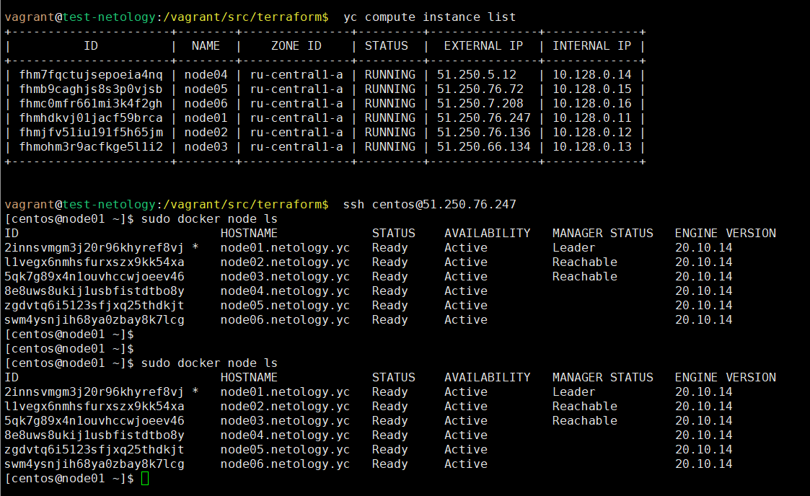

### Задача 1  
- В чём отличие режимов работы сервисов в Docker Swarm кластере: replication и global?  
**Ответ:** В режиме `replication` на нодах кластера запускается на выполнение такое количество задач сервиса, которое 
указано в параметре сервиса `--replicas`. Например, если в параметрах сервиса указано `--replicas=4`, а кластер состоит 
из 6 нод, то только на 4-х нодах из 6 доступных будут работать задачи данного сервиса. Если затем изменить количество реплик 
сервиса на `--replicas=12`, то на каждой из 6 нод кластера будут работать по 2 экземпляра задачи данного сервиса.
В режиме `global` на каждой доступной ноде кластера запустится по одной задаче сервиса.
- Какой алгоритм выбора лидера используется в Docker Swarm кластере?  
**Ответ:** для выбора лидера в кластере Docker Swarm используется алгоритм `RAFT`  
- Что такое Overlay Network?  
**Ответ:** Overlay Network в контексте кластера Docker Swarm - это виртуальная сеть, которая используется для 
возможности объединения сервисов (контейнеров) в единую сеть. Overlay-сеть не создается по умолчанию при старте контейнера, в 
отличии от `ingress`-сети (обслуживает входящий из вне трафик в контейнер) и `docker_gwbridge`-сети (обслуживает
исходящий из контейнера трафик во вне). Т.о. если требуется сеть между сервисами (контейнерами) кластера, то необходимо
дополнительно создать overlay-сеть и привязать сервисы docker swarm к этой сети. 


### Задача 2 + Задача 3

Кластер Docker Swarm развернут на ВМ:

```shell
vagrant@test-netology:/vagrant/src/terraform$  yc compute instance list
+----------------------+--------+---------------+---------+---------------+-------------+
|          ID          |  NAME  |    ZONE ID    | STATUS  |  EXTERNAL IP  | INTERNAL IP |
+----------------------+--------+---------------+---------+---------------+-------------+
| fhm7fqctujsepoeia4nq | node04 | ru-central1-a | RUNNING | 51.250.5.12   | 10.128.0.14 |
| fhmb9caghjs8s3p0vjsb | node05 | ru-central1-a | RUNNING | 51.250.76.72  | 10.128.0.15 |
| fhmc0mfr661mi3k4f2gh | node06 | ru-central1-a | RUNNING | 51.250.7.208  | 10.128.0.16 |
| fhmhdkvj01jacf59brca | node01 | ru-central1-a | RUNNING | 51.250.76.247 | 10.128.0.11 |
| fhmjfv51iu191f5h65jm | node02 | ru-central1-a | RUNNING | 51.250.76.136 | 10.128.0.12 |
| fhmohm3r9acfkge5l1i2 | node03 | ru-central1-a | RUNNING | 51.250.66.134 | 10.128.0.13 |
+----------------------+--------+---------------+---------+---------------+-------------+

vagrant@test-netology:/vagrant/src/terraform$  ssh centos@51.250.76.247
[centos@node01 ~]$ sudo docker node ls
ID                            HOSTNAME             STATUS    AVAILABILITY   MANAGER STATUS   ENGINE VERSION
2innsvmgm3j20r96khyref8vj *   node01.netology.yc   Ready     Active         Leader           20.10.14
l1vegx6nmhsfurxszx9kk54xa     node02.netology.yc   Ready     Active         Reachable        20.10.14
5qk7g89x4n1ouvhccwjoeev46     node03.netology.yc   Ready     Active         Reachable        20.10.14
8e8uws8ukij1usbfistdtbo8y     node04.netology.yc   Ready     Active                          20.10.14
zgdvtq6i5123sfjxq25thdkjt     node05.netology.yc   Ready     Active                          20.10.14
swm4ysnjih68ya0zbay8k7lcg     node06.netology.yc   Ready     Active                          20.10.14

[centos@node01 ~]$ sudo docker service ls
ID             NAME                                MODE         REPLICAS   IMAGE                                          PORTS
blllpm67a811   swarm_monitoring_alertmanager       replicated   1/1        stefanprodan/swarmprom-alertmanager:v0.14.0    
wxqpwsepsavc   swarm_monitoring_caddy              replicated   1/1        stefanprodan/caddy:latest                      *:3000->3000/tcp, *:9090->9090/tcp, *:9093-9094->9093-9094/tcp
q4f7j8ah1qur   swarm_monitoring_cadvisor           global       6/6        google/cadvisor:latest                         
rxir7bn3mcxo   swarm_monitoring_dockerd-exporter   global       6/6        stefanprodan/caddy:latest                      
36nyuuvzvy13   swarm_monitoring_grafana            replicated   1/1        stefanprodan/swarmprom-grafana:5.3.4           
kx87dodz46pg   swarm_monitoring_node-exporter      global       6/6        stefanprodan/swarmprom-node-exporter:v0.16.0   
l5zka8z7lfwg   swarm_monitoring_prometheus         replicated   1/1        stefanprodan/swarmprom-prometheus:v2.5.0       
t5bulbthby1f   swarm_monitoring_unsee              replicated   1/1        cloudflare/unsee:v0.8.0                        
[centos@node01 ~]$
```



### Задача 4

```shell
[centos@node01 ~]$ sudo docker swarm update --autolock=true
Swarm updated.
To unlock a swarm manager after it restarts, run the `docker swarm unlock`
command and provide the following key:

    SWMKEY-1-7F2NjWiHkzYKMFpzfwU7p/TfwoVOUnRT0ECZBrm8pSc

Please remember to store this key in a password manager, since without it you
will not be able to restart the manager.
```

Команда нужна, чтобы заблокировать кластер Docker Swarm, т.е. невозможно будет производить какие-либо действия с 
кластером до тех пор, пока кластер не будет разблокирован. Кластер перейдет в заблокированное состояние после рестарта
службы docker. Для разблокировки кластера необходимо выполнить команду:
`docker swarm unlock` и передать ей ключ, созданный при блокировке кластер

```shell
[centos@node01 ~]$ sudo docker swarm unlock
Please enter unlock key: SWMKEY-1-7F2NjWiHkzYKMFpzfwU7p/TfwoVOUnRT0ECZBrm8pSc 
```
Ключ разблокировки нужно хранить в надежном месте.  
Текущий ключ разблокировки можно посмотреть командой `docker swarm unlock-key`:  
```shell
[centos@node01 ~]$ sudo docker swarm unlock-key
To unlock a swarm manager after it restarts, run the `docker swarm unlock`
command and provide the following key:

    SWMKEY-1-7F2NjWiHkzYKMFpzfwU7p/TfwoVOUnRT0ECZBrm8pSc

Please remember to store this key in a password manager, since without it you
will not be able to restart the manager.
```

Ключ разблокировки можно изменить командой `docker swarm unlock-key --rotate` (например, если он был скомпрометирован):  

```shell
[centos@node01 ~]$ sudo docker swarm unlock-key --rotate
Successfully rotated manager unlock key.

To unlock a swarm manager after it restarts, run the `docker swarm unlock`
command and provide the following key:

    SWMKEY-1-IYcD5x0NzWwC7mSuTEPdjM4ouqcsTD5QstSXevEqNGY

Please remember to store this key in a password manager, since without it you
will not be able to restart the manager.
```

Отключить блокирование кластера можно командой `docker swarm update --autolock=false`:

```shell
[centos@node01 ~]$ sudo docker swarm update --autolock=false
Swarm updated.
```