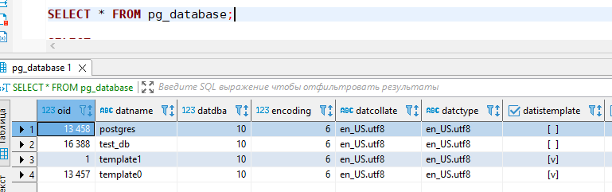
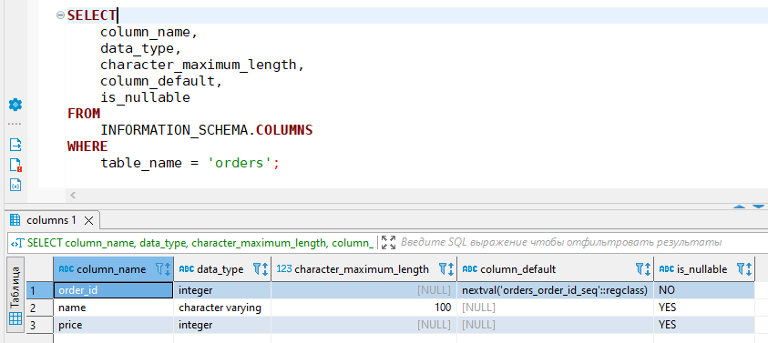
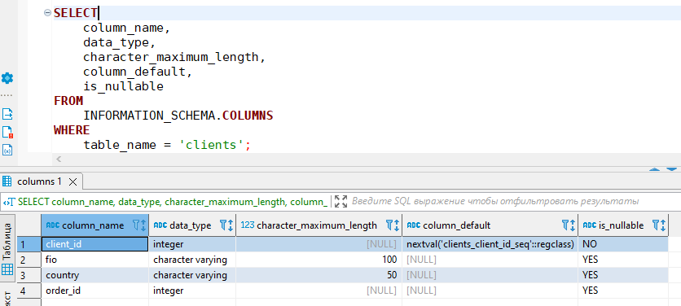
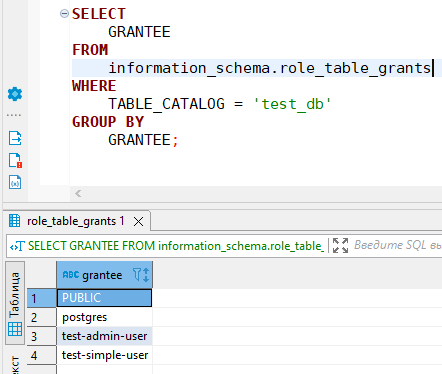
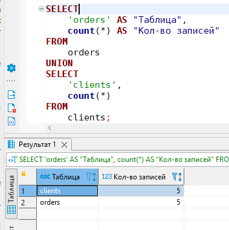
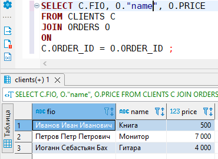
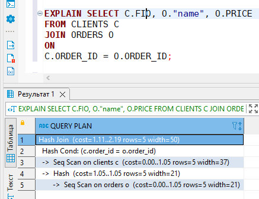

### Задача 1  
Используя docker поднимите инстанс PostgreSQL (версию 12) c 2 volume, в который будут складываться данные БД и бэкапы.  
Приведите получившуюся команду или docker-compose манифест.  
[docker-compose.yml](src/postgres/docker-compose.yml)

### Задача 2
В БД из задачи 1:  
- создайте пользователя test-admin-user и БД test_db  
  ```
  CREATE USER "test-admin-user" WITH PASSWORD '12345';
  CREATE DATABASE test_db TEMPLATE template0 ENCODING UTF8 CONNECTION LIMIT 5;
  ```
- в БД test_db создайте таблицу orders и clients (спeцификация таблиц ниже)  
  Таблица orders:  
  - id (serial primary key)  
  - наименование (string)  
  - цена (integer) 
  ```
  CREATE TABLE orders (order_id SERIAL PRIMARY KEY,
  name VARCHAR(100),
  price INTEGER);
  ```
  Таблица clients:    
  - id (serial primary key)  
  - фамилия (string)  
  - страна проживания (string, index)  
  - заказ (foreign key orders)  
  ```
  CREATE TABLE clients (client_id SERIAL PRIMARY KEY,
  fio VARCHAR(100),
  country VARCHAR(50),
  order_id integer REFERENCES orders (order_id));
  ```
- предоставьте привилегии на все операции пользователю test-admin-user на таблицы БД test_db  
  ```
  GRANT ALL PRIVILEGES ON
  ALL TABLES IN SCHEMA public TO "test-admin-user"
  ```
- создайте пользователя test-simple-user  
  ```
  CREATE USER "test-simple-user" WITH PASSWORD '54321';
  ```
- предоставьте пользователю test-simple-user права на SELECT/INSERT/UPDATE/DELETE данных таблиц БД test_db  
  ```
  GRANT SELECT, INSERT, UPDATE, DELETE ON
  ALL TABLES IN SCHEMA public TO "test-simple-user";
  ```

Приведите:  
- итоговый список БД после выполнения пунктов выше  
  ```
  SELECT * FROM pg_database;
  ```
    
  или:  
  ```shell
  vagrant@test-netology:/homeworks/06-db-02-sql/src/postgres $ docker exec -it -u postgres postgres-12 psql -d test_db
  psql (12.12 (Debian 12.12-1.pgdg110+1))
  Type "help" for help.
  
  test_db=# \l
                                   List of databases
     Name    |  Owner   | Encoding |  Collate   |   Ctype    |   Access privileges
  -----------+----------+----------+------------+------------+-----------------------
   postgres  | postgres | UTF8     | en_US.utf8 | en_US.utf8 |
   template0 | postgres | UTF8     | en_US.utf8 | en_US.utf8 | =c/postgres          +
             |          |          |            |            | postgres=CTc/postgres
   template1 | postgres | UTF8     | en_US.utf8 | en_US.utf8 | =c/postgres          +
             |          |          |            |            | postgres=CTc/postgres
   test_db   | postgres | UTF8     | en_US.utf8 | en_US.utf8 |
  (4 rows)
  ```
- описание таблиц (describe)  
  ```
    test_db=# \dS+ orders
                                                              Table "public.orders"
    Column  |          Type          | Collation | Nullable |                 Default                  | Storage  | Stats target | Description
  ----------+------------------------+-----------+----------+------------------------------------------+----------+--------------+-------------
   order_id | integer                |           | not null | nextval('orders_order_id_seq'::regclass) | plain    |              |
   name     | character varying(100) |           |          |                                          | extended |              |
   price    | integer                |           |          |                                          | plain    |              |
  Indexes:
      "orders_pkey" PRIMARY KEY, btree (order_id)
  Referenced by:
      TABLE "clients" CONSTRAINT "clients_order_id_fkey" FOREIGN KEY (order_id) REFERENCES orders(order_id)
  Access method: heap
  
  test_db=# \dS+ clients
                                                               Table "public.clients"
    Column   |          Type          | Collation | Nullable |                  Default                   | Storage  | Stats target | Description
  -----------+------------------------+-----------+----------+--------------------------------------------+----------+--------------+-------------
   client_id | integer                |           | not null | nextval('clients_client_id_seq'::regclass) | plain    |              |
   fio       | character varying(100) |           |          |                                            | extended |              |
   country   | character varying(50)  |           |          |                                            | extended |              |
   order_id  | integer                |           |          |                                            | plain    |              |
  Indexes:
      "clients_pkey" PRIMARY KEY, btree (client_id)
  Foreign-key constraints:
      "clients_order_id_fkey" FOREIGN KEY (order_id) REFERENCES orders(order_id)
  Access method: heap
  ```
  ```
    SELECT
      column_name,
      data_type,
      character_maximum_length,
      column_default,
      is_nullable
  FROM
      INFORMATION_SCHEMA.COLUMNS
  WHERE
      table_name = 'orders';
   
  SELECT
      column_name,
      data_type,
      character_maximum_length,
      column_default,
      is_nullable
  FROM
      INFORMATION_SCHEMA.COLUMNS
  WHERE
      table_name = 'clients';
  ```
    
    

- SQL-запрос для выдачи списка пользователей с правами над таблицами test_db  
- список пользователей с правами над таблицами test_db  
  ```
  SELECT GRANTEE
  FROM information_schema.role_table_grants
  WHERE TABLE_CATALOG = 'test_db'
  GROUP BY
      GRANTEE;
  ```
    


### Задача 3  
Используя SQL синтаксис - наполните таблицы следующими тестовыми данными:  

Таблица orders

|Наименование|цена|
|------------|----|
|Шоколад| 10 |
|Принтер| 3000 |
|Книга| 500 |
|Монитор| 7000|
|Гитара| 4000|


```
INSERT INTO orders (name, price) VALUES ('Шоколад', 10);
INSERT INTO orders (name, price) VALUES ('Принтер', 3000);
INSERT INTO orders (name, price) VALUES ('Книга', 500);
INSERT INTO orders (name, price) VALUES ('Монитор', 7000);
INSERT INTO orders (name, price) VALUES ('Гитара', 4000);
```

Таблица clients

|ФИО|Страна проживания|
|------------|----|
|Иванов Иван Иванович| USA |
|Петров Петр Петрович| Canada |
|Иоганн Себастьян Бах| Japan |
|Ронни Джеймс Дио| Russia|
|Ritchie Blackmore| Russia|


```
INSERT INTO clients (fio, country) VALUES ('Иванов Иван Иванович', 'USA');
INSERT INTO clients (fio, country) VALUES ('Петров Петр Петрович', 'Canada');
INSERT INTO clients (fio, country) VALUES ('Иоганн Себастьян Бах', 'Japan');
INSERT INTO clients (fio, country) VALUES ('Ронни Джеймс Дио', 'Russia');
INSERT INTO clients (fio, country) VALUES ('Ritchie Blackmore', 'Russia');
```

Используя SQL синтаксис:  
- вычислите количество записей для каждой таблицы  
- приведите в ответе:  
  - запросы  
  - результаты их выполнения.

  ```
  SELECT 'orders' AS "Таблица", count(*) AS "Кол-во записей"
  FROM orders
  UNION
  SELECT 'clients', count(*)
  FROM clients;
  ```

  

### Задача 4

Часть пользователей из таблицы clients решили оформить заказы из таблицы orders.
Используя foreign keys свяжите записи из таблиц, согласно таблице:

|ФИО|Заказ|
|------------|----|
|Иванов Иван Иванович| Книга |
|Петров Петр Петрович| Монитор |
|Иоганн Себастьян Бах| Гитара |

Приведите SQL-запросы для выполнения данных операций:  

```
UPDATE CLIENTS
SET
    ORDER_ID = (
    SELECT order_id
FROM orders o
WHERE name = 'Книга')
WHERE FIO = 'Иванов Иван Иванович';

UPDATE CLIENTS
SET
    ORDER_ID = (
    SELECT order_id
FROM orders o
WHERE name = 'Монитор')
WHERE FIO = 'Петров Петр Петрович';

UPDATE CLIENTS
SET
    ORDER_ID = (
    SELECT order_id
FROM orders o
WHERE name = 'Гитара')
WHERE FIO = 'Иоганн Себастьян Бах';
```

Приведите SQL-запрос для выдачи всех пользователей, которые совершили заказ, а также вывод данного запроса:  

```
SELECT C.FIO, O."name", O.PRICE
FROM CLIENTS C
JOIN ORDERS O 
ON
C.ORDER_ID = O.ORDER_ID;
```
или:
```
SELECT C.FIO, O."name", O.PRICE
FROM CLIENTS C, ORDERS O
WHERE C.ORDER_ID = O.ORDER_ID;
```
  


### Задача 5

Получите полную информацию по выполнению запроса выдачи всех пользователей из задачи 4 (используя директиву EXPLAIN).  
Приведите получившийся результат и объясните что значат полученные значения.    
  
```
EXPLAIN SELECT C.FIO, O."name", O.PRICE
FROM CLIENTS C
JOIN ORDERS O 
ON
C.ORDER_ID = O.ORDER_ID;

--- QUERT PLAN ----------------------------------
Hash Join  (cost=1.11..2.19 rows=5 width=50)
  Hash Cond: (c.order_id = o.order_id)
  ->  Seq Scan on clients c  (cost=0.00..1.05 rows=5 width=37)
  ->  Hash  (cost=1.05..1.05 rows=5 width=21)
      ->  Seq Scan on orders o  (cost=0.00..1.05 rows=5 width=21)
```  

План запроса читаем снизу-вверх:  
1) `Seq Scan on orders o  (cost=0.00..1.05 rows=5 width=21)` - выполняется последовательное сканирование таблицы `orders`  
2) `Hash  (cost=1.05..1.05 rows=5 width=21)` - в памяти создается hash-таблица с результатами сканирования таблицы `orders`  
3) `Seq Scan on clients c  (cost=0.00..1.05 rows=5 width=37)` - выполняется последовательное сканирование таблицы `clients`
4) `Hash Cond: (c.order_id = o.order_id)` - выполняется сравнение строк выборки из таблицы `clients` с hash-таблицей,  
созданной в результате сканирования таблицы `orders`  
5) `Hash Join  (cost=1.11..2.19 rows=5 width=50)` - выполняется соединение результатов выборок по hash'у  
  
Цифры на каждом узле плана `(cost=1.11..2.19 rows=5 width=50)` обозначают соответственно:  
1) приблизительное стоимость запуска узла плана  
2) приблизительная общая стоимость выполнения узла плана  
3) предполагаемое число строк, которое должен вернуть узел плана  
4) предполагаемый средний размер строк в байтах, который должен вернуть узел плана   


### Задача 6  
Создайте бэкап БД test_db и поместите его в volume, предназначенный для бэкапов (см. Задачу 1).
```shell
docker exec -it -u postgres postgres-12 pg_dumpall -v --file /pgbackup/test_db.dmp --exclude-database postgres
```

Остановите контейнер с PostgreSQL (но не удаляйте volumes).  
Поднимите новый пустой контейнер с PostgreSQL: [docker-compose.yml](src/postgres-restore/docker-compose.yml)  

Восстановите БД test_db в новом контейнере:  
```shell
docker exec -it -u postgres postgres-12-restore psql -f /pgbackup/test_db.dmp
```

```shell
docker exec -it -u postgres postgres-12-restore psql -l
                                 List of databases
   Name    |  Owner   | Encoding |  Collate   |   Ctype    |   Access privileges
-----------+----------+----------+------------+------------+-----------------------
 postgres  | postgres | UTF8     | en_US.utf8 | en_US.utf8 |
 template0 | postgres | UTF8     | en_US.utf8 | en_US.utf8 | =c/postgres          +
           |          |          |            |            | postgres=CTc/postgres
 template1 | postgres | UTF8     | en_US.utf8 | en_US.utf8 | =c/postgres          +
           |          |          |            |            | postgres=CTc/postgres
 test_db   | postgres | UTF8     | en_US.utf8 | en_US.utf8 |
(4 rows)
```

Приведите список операций, который вы применяли для бэкапа данных и восстановления. 