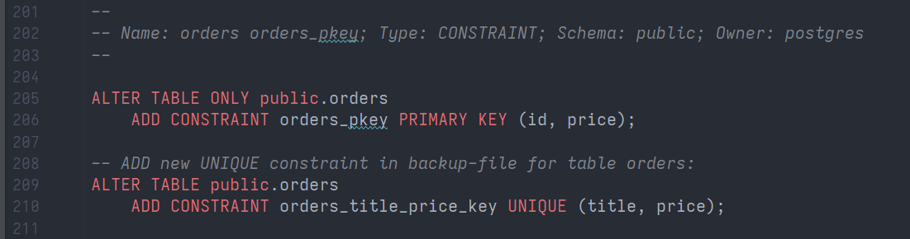

## Задача 1

Используя docker поднимите инстанс PostgreSQL (версию 13). Данные БД сохраните в volume.
[docker-compose.yml](src/postgres/docker-compose.yml)

Подключитесь к БД PostgreSQL используя `psql`.
```shell
vagrant@test-netology:~ $ docker exec -u postgres -it postgres-13 psql
psql (13.8 (Debian 13.8-1.pgdg110+1))
Type "help" for help.

postgres=#
```
Воспользуйтесь командой `\?` для вывода подсказки по имеющимся в `psql` управляющим командам 
(или `psql --help=commands`).


**Найдите и приведите** управляющие команды для:
- вывода списка БД
  в `psql` в интерактивном режиме:  
  ```shell
  postgres=# \l+
                                                                     List of databases
     Name    |  Owner   | Encoding |  Collate   |   Ctype    |   Access privileges   |  Size   | Tablespace |                Description
  -----------+----------+----------+------------+------------+-----------------------+---------+------------+--------------------------------------------
   postgres  | postgres | UTF8     | en_US.utf8 | en_US.utf8 |                       | 7901 kB | pg_default | default administrative connection database
   template0 | postgres | UTF8     | en_US.utf8 | en_US.utf8 | =c/postgres          +| 7753 kB | pg_default | unmodifiable empty database
             |          |          |            |            | postgres=CTc/postgres |         |            |
   template1 | postgres | UTF8     | en_US.utf8 | en_US.utf8 | =c/postgres          +| 7753 kB | pg_default | default template for new databases
             |          |          |            |            | postgres=CTc/postgres |         |            |
  (3 rows)
  ```
  выполнить только одну команду `psql`:  
  ```shell
    vagrant@test-netology:~ $ docker exec -it -u postgres postgres-13 psql -c "\l"
                                   List of databases
     Name    |  Owner   | Encoding |  Collate   |   Ctype    |   Access privileges
  -----------+----------+----------+------------+------------+-----------------------
   postgres  | postgres | UTF8     | en_US.utf8 | en_US.utf8 |
   template0 | postgres | UTF8     | en_US.utf8 | en_US.utf8 | =c/postgres          +
             |          |          |            |            | postgres=CTc/postgres
   template1 | postgres | UTF8     | en_US.utf8 | en_US.utf8 | =c/postgres          +
             |          |          |            |            | postgres=CTc/postgres
  (3 rows)
  ```

- подключения к БД
  ```shell
  vagrant@test-netology:~ $ docker exec -u postgres -it postgres-13 psql -h localhost -p 5432 -U postgres
  psql (13.8 (Debian 13.8-1.pgdg110+1))
  Type "help" for help.
  
  postgres=# \connect
  You are now connected to database "postgres" as user "postgres".
  ```
  
- вывода списка таблиц
  ```shell
  postgres=# \dt
  Did not find any relations.
    ```
  
- т.к. бд пустая, то в ней есть только системные таблицы и представления:
  ```shell
    postgres=# \dtS+
                                              List of relations
     Schema   |              Name               | Type  |  Owner   | Persistence |    Size    | Description
  ------------+---------------------------------+-------+----------+-------------+------------+-------------
   pg_catalog | pg_aggregate                    | table | postgres | permanent   | 56 kB      |
   pg_catalog | pg_am                           | table | postgres | permanent   | 40 kB      |
   pg_catalog | pg_amop                         | table | postgres | permanent   | 80 kB      |
   pg_catalog | pg_amproc                       | table | postgres | permanent   | 64 kB      |
   pg_catalog | pg_attrdef                      | table | postgres | permanent   | 8192 bytes |
   pg_catalog | pg_attribute                    | table | postgres | permanent   | 456 kB     |
   pg_catalog | pg_auth_members                 | table | postgres | permanent   | 40 kB      |
   pg_catalog | pg_authid                       | table | postgres | permanent   | 48 kB      |
  ```

- вывода описания содержимого таблиц
  ```shell
    postgres=# \d+ pg_am
                                    Table "pg_catalog.pg_am"
    Column   |  Type   | Collation | Nullable | Default | Storage | Stats target | Description
  -----------+---------+-----------+----------+---------+---------+--------------+-------------
   oid       | oid     |           | not null |         | plain   |              |
   amname    | name    |           | not null |         | plain   |              |
   amhandler | regproc |           | not null |         | plain   |              |
   amtype    | "char"  |           | not null |         | plain   |              |
  Indexes:
      "pg_am_name_index" UNIQUE, btree (amname)
      "pg_am_oid_index" UNIQUE, btree (oid)
  Access method: heap
  ```
- выхода из psql
  ```shell
  postgres=# \q
  ```


## Задача 2

Используя `psql` создайте БД `test_database`.

```shell
vagrant@test-netology:~ $ docker exec -u postgres -it postgres-13 psql
psql (13.8 (Debian 13.8-1.pgdg110+1))
Type "help" for help.

postgres=# CREATE DATABASE "test_database";
CREATE DATABASE
postgres=#
```

Изучите [бэкап БД](https://github.com/netology-code/virt-homeworks/tree/master/06-db-04-postgresql/test_data).

Восстановите бэкап БД в `test_database`.

```shell
vagrant@test-netology:~ $ docker exec -u postgres -it postgres-13 psql -f /pgbackup/test_dump.sql -d test_database
SET
SET
SET
SET
SET
 set_config
------------

(1 row)

SET
SET
SET
SET
SET
SET
CREATE TABLE
ALTER TABLE
CREATE SEQUENCE
ALTER TABLE
ALTER SEQUENCE
ALTER TABLE
COPY 8
 setval
--------
      8
(1 row)

ALTER TABLE

vagrant@test-netology:~ $ docker exec -u postgres -it postgres-13 psql -c "\l"
                                   List of databases
     Name      |  Owner   | Encoding |  Collate   |   Ctype    |   Access privileges
---------------+----------+----------+------------+------------+-----------------------
 postgres      | postgres | UTF8     | en_US.utf8 | en_US.utf8 |
 template0     | postgres | UTF8     | en_US.utf8 | en_US.utf8 | =c/postgres          +
               |          |          |            |            | postgres=CTc/postgres
 template1     | postgres | UTF8     | en_US.utf8 | en_US.utf8 | =c/postgres          +
               |          |          |            |            | postgres=CTc/postgres
 test_database | postgres | UTF8     | en_US.utf8 | en_US.utf8 |
(4 rows)
```

Перейдите в управляющую консоль `psql` внутри контейнера.

```shell
vagrant@test-netology:~ $ docker exec -u postgres -it postgres-13 psql -d test_database
psql (13.8 (Debian 13.8-1.pgdg110+1))
Type "help" for help.

test_database=#
```

Подключитесь к восстановленной БД и проведите операцию ANALYZE для сбора статистики по таблице.

```shell
test_database=# \d
              List of relations
 Schema |     Name      |   Type   |  Owner
--------+---------------+----------+----------
 public | orders        | table    | postgres
 public | orders_id_seq | sequence | postgres
(2 rows)

test_database=# ANALYZE orders;
ANALYZE
test_database=#
```

Используя таблицу [pg_stats](https://postgrespro.ru/docs/postgresql/12/view-pg-stats), найдите столбец таблицы `orders` 
с наибольшим средним значением размера элементов в байтах.

**Приведите в ответе** команду, которую вы использовали для вычисления и полученный результат:

```
test_database=# SELECT TABLENAME, ATTNAME, max(AVG_WIDTH)
FROM PG_CATALOG.PG_STATS
WHERE TABLENAME = 'orders'
GROUP BY TABLENAME, ATTNAME
ORDER BY 3 DESC
LIMIT 1;
 tablename | attname | max
-----------+---------+-----
 orders    | title   |  16
(1 row)

```


## Задача 3

Архитектор и администратор БД выяснили, что ваша таблица orders разрослась до невиданных размеров и
поиск по ней занимает долгое время. Вам, как успешному выпускнику курсов DevOps в нетологии предложили
провести разбиение таблицы на 2 (шардировать на orders_1 - price>499 и orders_2 - price<=499).

Предложите SQL-транзакцию для проведения данной операции: [recreate-table-with-partitions.sql](src/sql/recreate-table-with-partitions.sql)

Результат работы скрипта:

```shell
vagrant@test-netology:~ $ docker exec -u postgres -it postgres-13 psql -f /pgbackup/recreate-table-with-partitions.sql -d test_database
BEGIN
CREATE TABLE
INSERT 0 3
CREATE TABLE
INSERT 0 5
CREATE TABLE
INSERT 0 1
DROP TABLE
CREATE TABLE
 setval
--------
      8
(1 row)

ALTER TABLE
ALTER TABLE
COMMIT
INSERT 0 1
INSERT 0 1
INSERT 0 1
INSERT 0 1
 id |         title          | price
----+------------------------+-------
  1 | War and peace          |   100
  2 | My little database     |   500
  3 | Adventure psql time    |   300
  4 | Server gravity falls   |   300
  5 | Log gossips            |   123
  6 | WAL never lies         |   900
  7 | Me and my bash-pet     |   499
  8 | Dbiezdmin              |   501
  9 | Docker easy            |  1500
 10 | Openshift is power     |     5
 11 | Windows XP was not bad |  2050
 12 | But Linux is better    |   450
(12 rows)

 id |         title          | price
----+------------------------+-------
  2 | My little database     |   500
  6 | WAL never lies         |   900
  8 | Dbiezdmin              |   501
  9 | Docker easy            |  1500
 11 | Windows XP was not bad |  2050
(5 rows)

 id |        title         | price
----+----------------------+-------
  1 | War and peace        |   100
  3 | Adventure psql time  |   300
  4 | Server gravity falls |   300
  5 | Log gossips          |   123
  7 | Me and my bash-pet   |   499
 10 | Openshift is power   |     5
 12 | But Linux is better  |   450
(7 rows)

```

Еще один вариант решения [recreate-table-with-partitions-v2.sql](src/sql/recreate-table-with-partitions-v2.sql)

Результат работы скрипта:

```shell
vagrant@test-netology:~ $ docker exec -u postgres -it postgres-13 psql -f /pgbackup/recreate-table-with-partitions-v2.sql -d test_database
BEGIN
SELECT 8
CREATE TABLE
INSERT 0 1
DROP TABLE
CREATE TABLE
 setval
--------
      8
(1 row)

CREATE TABLE
CREATE TABLE
ALTER TABLE
ALTER TABLE
INSERT 0 8
DROP TABLE
COMMIT
INSERT 0 1
INSERT 0 1
INSERT 0 1
INSERT 0 1
 id |         title          | price
----+------------------------+-------
  1 | War and peace          |   100
  2 | My little database     |   500
  3 | Adventure psql time    |   300
  4 | Server gravity falls   |   300
  5 | Log gossips            |   123
  6 | WAL never lies         |   900
  7 | Me and my bash-pet     |   499
  8 | Dbiezdmin              |   501
  9 | Docker easy            |  1500
 10 | Openshift is power     |     5
 11 | Windows XP was not bad |  2050
 12 | But Linux is better    |   450
(12 rows)

 id |         title          | price
----+------------------------+-------
  2 | My little database     |   500
  6 | WAL never lies         |   900
  8 | Dbiezdmin              |   501
  9 | Docker easy            |  1500
 11 | Windows XP was not bad |  2050
(5 rows)

 id |        title         | price
----+----------------------+-------
  1 | War and peace        |   100
  3 | Adventure psql time  |   300
  4 | Server gravity falls |   300
  5 | Log gossips          |   123
  7 | Me and my bash-pet   |   499
 10 | Openshift is power   |     5
 12 | But Linux is better  |   450
(7 rows)
```


Можно ли было изначально исключить "ручное" разбиение при проектировании таблицы orders?

Можно, для этого при создании таблицы `orders` нужно было выполнить инструкции [create-partitionable-table-and-sections.sql](src/sql/create-partitionable-table-and-sections.sql).

Результат работы скрипта:
```shell
vagrant@test-netology:~ $ docker exec -u postgres -it postgres-13 psql -f /pgbackup/create-partitionable-table-and-sections.sql -d test_database
DROP TABLE
CREATE TABLE
CREATE TABLE
CREATE TABLE
INSERT 0 1
INSERT 0 1
INSERT 0 1
INSERT 0 1
 id |         title          | price
----+------------------------+-------
  1 | Docker easy            |  1500
  2 | Openshift is power     |     5
  3 | Windows XP was not bad |  2050
  4 | But Linux is better    |   450
(4 rows)

 id |         title          | price
----+------------------------+-------
  1 | Docker easy            |  1500
  3 | Windows XP was not bad |  2050
(2 rows)

 id |        title        | price
----+---------------------+-------
  2 | Openshift is power  |     5
  4 | But Linux is better |   450
(2 rows)
```


## Задача 4

Используя утилиту `pg_dump` создайте бекап БД `test_database`.

```shell
vagrant@test-netology:~ $ docker exec -u postgres postgres-13 pg_dump -d test_database -F p -b -f /pgbackup/test_database.dmp
```

Как бы вы доработали бэкап-файл, чтобы добавить уникальность значения столбца `title` для таблиц `test_database`?

В полученном бэкап-файле [test_database.sql](src/sql/test_database.sql) добавим инструкцию:

```
-- ADD new UNIQUE constraint in backup-file for table orders:
ALTER TABLE public.orders
    ADD CONSTRAINT orders_title_price_key UNIQUE (title, price);
```

В позицию строки 209:



Восстановим измененный бэкап-файл в новую БД `test_database_2`:

```shell
vagrant@test-netology:~ $ docker exec -u postgres postgres-13 dropdb -f --if-exists -e test_database_2
SELECT pg_catalog.set_config('search_path', '', false);
DROP DATABASE IF EXISTS test_database_2 WITH (FORCE);

vagrant@test-netology:~ $ docker exec -u postgres postgres-13 psql -c "CREATE DATABASE test_database_2"
CREATE DATABASE

vagrant@test-netology:~ $ docker exec -u postgres postgres-13 psql -d test_database_2 -f /pgbackup/test_database.sql
```

Проверим, что ограничение уникальности работает:

```
vagrant@test-netology:~ $ docker exec -it -u postgres postgres-13 psql -d test_database_2
psql (13.8 (Debian 13.8-1.pgdg110+1))
Type "help" for help.

test_database_2=# \d orders
                             Partitioned table "public.orders"
 Column |         Type          | Collation | Nullable |              Default
--------+-----------------------+-----------+----------+------------------------------------
 id     | integer               |           | not null | nextval('orders_id_seq'::regclass)
 title  | character varying(80) |           | not null |
 price  | integer               |           | not null | 0
Partition key: RANGE (price)
Indexes:
    "orders_pkey" PRIMARY KEY, btree (id, price)
    "orders_title_price_key" UNIQUE CONSTRAINT, btree (title, price)
Number of partitions: 2 (Use \d+ to list them.)


test_database_2=# INSERT INTO orders (title, price) VALUES('Windows XP was not bad', 3000);
INSERT 0 1

test_database_2=# INSERT INTO orders (title, price) VALUES('Windows XP was not bad', 3000);
ERROR:  duplicate key value violates unique constraint "orders_1_title_price_key"
DETAIL:  Key (title, price)=(Windows XP was not bad, 3000) already exists.

test_database_2=# SELECT * FROM orders ORDER BY 1;
 id |         title          | price
----+------------------------+-------
  1 | War and peace          |   100
  2 | My little database     |   500
  3 | Adventure psql time    |   300
  4 | Server gravity falls   |   300
  5 | Log gossips            |   123
  6 | WAL never lies         |   900
  7 | Me and my bash-pet     |   499
  8 | Dbiezdmin              |   501
  9 | Docker easy            |  1500
 10 | Openshift is power     |     5
 11 | Windows XP was not bad |  2050
 12 | But Linux is better    |   450
 13 | Windows XP was not bad |  3000

```

Первая вставка `INSERT INTO orders (title, price) VALUES('Windows XP was not bad', 3000);` выполнилась.
При попытке повторно вставить данные, которые уже есть в таблице и образуют ограничение уникальности, 
получаем ошибку `ERROR:  duplicate key value violates unique constraint "orders_1_title_price_key"`.