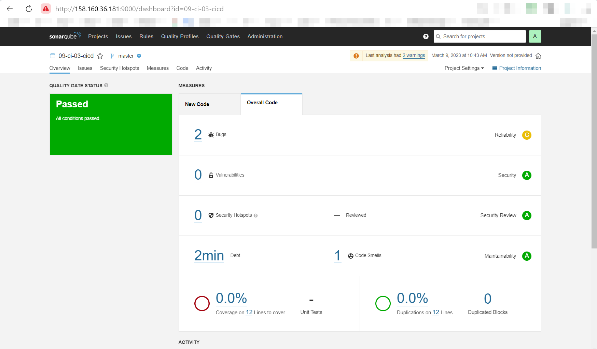
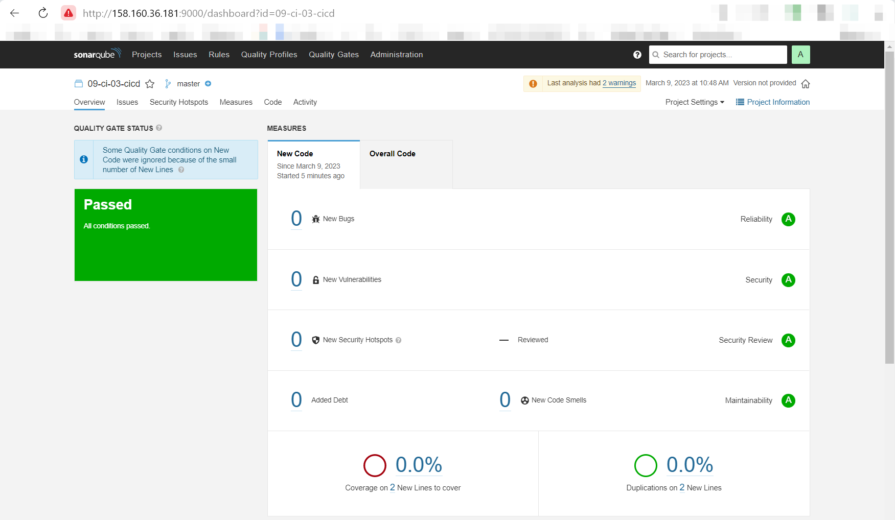
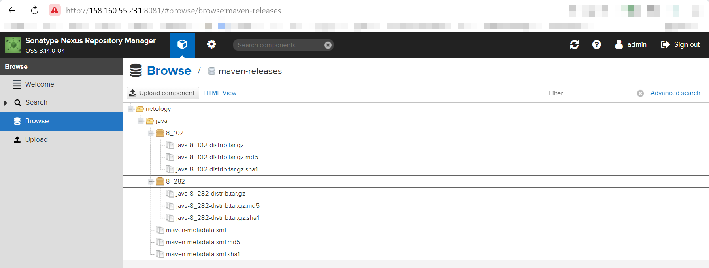

# Домашнее задание к занятию "09.03 CI\CD"

## Подготовка к выполнению

1. Создаём 2 VM в yandex cloud со следующими параметрами: 2CPU 4RAM Centos7(остальное по минимальным требованиям):

   |ID |NAME |ZONE ID |STATUS |EXTERNAL IP |INTERNAL IP |
   |---|---|---|---|---|---|
   | fhm0488lnhbiklvoai2l | sonar-01 | ru-central1-a | RUNNING | 158.160.36.181 | 10.128.0.34 |
   | fhmu8ljsj9a6jqv432rv | nexus-01 | ru-central1-a | RUNNING | 158.160.55.231 | 10.128.0.27 |

1. Прописываем в [inventory](./infrastructure/inventory/cicd/hosts.yml) [playbook'a](./infrastructure/site.yml) созданные хосты
2. Добавляем в [files](./infrastructure/files/) файл со своим публичным ключом (id_rsa.pub). Если ключ называется иначе - найдите таску в плейбуке, которая использует id_rsa.pub имя и исправьте на своё
3. Запускаем playbook, ожидаем успешного завершения
4. Проверяем готовность Sonarqube через [браузер](http://158.160.36.181:9000)
5. Заходим под admin\admin, меняем пароль на свой
6. Проверяем готовность Nexus через [бразуер](http://158.160.55.231:8081)
7. Подключаемся под admin\admin123, меняем пароль, сохраняем анонимный доступ

## Знакомоство с SonarQube

### Основная часть

1. Создаём новый проект, название произвольное: **название проекта `09-ci-03-cicd`**
2. Скачиваем пакет sonar-scanner, который нам предлагает скачать сам sonarqube:
3. Делаем так, чтобы binary был доступен через вызов в shell (или меняем переменную PATH или любой другой удобный вам способ)
4. Проверяем `sonar-scanner --version`:
   ```shell
   vagrant@test-netology:~ $ wget -q https://binaries.sonarsource.com/Distribution/sonar-scanner-cli/sonar-scanner-cli-4.8.0.2856-linux.zip && \
   > unzip -q -d ~ sonar-scanner-cli-4.8.0.2856-linux.zip && \
   > export PATH=$PATH:~/sonar-scanner-4.8.0.2856-linux/bin/ && \
   > sonar-scanner --version
   INFO: Scanner configuration file: /home/vagrant/sonar-scanner-4.8.0.2856-linux/conf/sonar-scanner.properties
   INFO: Project root configuration file: NONE
   INFO: SonarScanner 4.8.0.2856
   INFO: Java 11.0.17 Eclipse Adoptium (64-bit)
   INFO: Linux 5.4.0-91-generic amd64
   ``` 
6. Запускаем анализатор против кода из директории [example](./example) с дополнительным ключом `-Dsonar.coverage.exclusions=fail.py`
7. Смотрим результат в интерфейсе:
   
8. Исправляем ошибки, которые он выявил(включая warnings)
9. Запускаем анализатор повторно - проверяем, что QG пройдены успешно
10. Делаем скриншот успешного прохождения анализа, прикладываем к решению ДЗ:
    

## Знакомство с Nexus

### Основная часть

1. В репозиторий `maven-releases` загружаем артефакт с GAV параметрами:
   1. groupId: netology
   2. artifactId: java
   3. version: 8_282
   4. classifier: distrib
   5. type: tar.gz
2. В него же загружаем такой же артефакт, но с version: 8_102
3. Проверяем, что все файлы загрузились успешно:
   
4. В ответе присылаем файл `maven-metadata.xml` для этого артефекта: **[maven-metadata.xml](src/xml/maven-metadata.xml)**

### Знакомство с Maven

### Подготовка к выполнению

1. Скачиваем дистрибутив с [maven](https://maven.apache.org/download.cgi)
2. Разархивируем, делаем так, чтобы binary был доступен через вызов в shell (или меняем переменную PATH или любой другой удобный вам способ):
   ```shell
   vagrant@test-netology:~ $ wget -q https://download.java.net/openjdk/jdk11/ri/openjdk-11+28_linux-x64_bin.tar.gz && \
   > sudo mkdir -p /opt/jdk && \
   > sudo tar -zxf openjdk-11+28_linux-x64_bin.tar.gz -C /opt/jdk/ && \
   > /opt/jdk/jdk-11/bin/java -version

   openjdk version "11" 2018-09-25
   OpenJDK Runtime Environment 18.9 (build 11+28)
   OpenJDK 64-Bit Server VM 18.9 (build 11+28, mixed mode)

   vagrant@test-netology:~ $ wget -q https://dlcdn.apache.org/maven/maven-3/3.9.0/binaries/apache-maven-3.9.0-bin.zip && \
   > sudo unzip -q -d /opt apache-maven-3.9.0-bin.zip && \
   > export PATH=$PATH:/opt/apache-maven-3.9.0/bin && \
   > export JAVA_HOME=/opt/jdk/jdk-11 && \
   > mvn --version

   Apache Maven 3.9.0 (9b58d2bad23a66be161c4664ef21ce219c2c8584)
   Maven home: /opt/apache-maven-3.9.0
   Java version: 11, vendor: Oracle Corporation, runtime: /opt/jdk/jdk-11
   Default locale: en_US, platform encoding: UTF-8
   OS name: "linux", version: "5.4.0-91-generic", arch: "amd64", family: "unix"
   ```
3. Удаляем из `apache-maven-<version>/conf/settings.xml` упоминание о правиле, отвергающем http соединение( раздел mirrors->id: my-repository-http-blocker): **закомментирован блок**
   ```xml
   <!--<mirror>
      <id>maven-default-http-blocker</id>
      <mirrorOf>external:http:*</mirrorOf>
      <name>Pseudo repository to mirror external repositories initially using HTTP.</name>
      <url>http://0.0.0.0/</url>
      <blocked>true</blocked>
    </mirror> -->

   ```
4. Проверяем `mvn --version`
   ```shell
   vagrant@test-netology:~ $ mvn --version
   
   Apache Maven 3.9.0 (9b58d2bad23a66be161c4664ef21ce219c2c8584)
   Maven home: /opt/apache-maven-3.9.0
   Java version: 11, vendor: Oracle Corporation, runtime: /opt/jdk/jdk-11
   Default locale: en_US, platform encoding: UTF-8
   OS name: "linux", version: "5.4.0-91-generic", arch: "amd64", family: "unix"
   ```

5. Забираем директорию [mvn](./mvn) с pom

### Основная часть

1. Меняем в `pom.xml` блок с зависимостями под наш артефакт из первого пункта задания для Nexus (java с версией 8_282)
2. Запускаем команду `mvn package` в директории с `pom.xml`, ожидаем успешного окончания
3. Проверяем директорию `~/.m2/repository/`, находим наш артефакт:
   ```shell
   vagrant@test-netology:/homeworks/09-ci-02-cicd/mvn $ ll ~/.m2/repository/netology/java/8_282/*.tar.gz
   -rw-rw-r-- 1 vagrant vagrant 0 Mar  9 13:21 /home/vagrant/.m2/repository/netology/java/8_282/java-8_282-distrib.tar.gz

   vagrant@test-netology:/homeworks/09-ci-02-cicd/mvn $ ll target/*.jar
   -rwxrwxrwx 1 vagrant vagrant 1522 Mar  9 13:22 target/simple-app-1.0-SNAPSHOT.jar
   ```
4. В ответе присылаем исправленный файл `pom.xml`: **[pom.xml](mvn/pom.xml)**

---

### Как оформить ДЗ?

Выполненное домашнее задание пришлите ссылкой на .md-файл в вашем репозитории.

---
