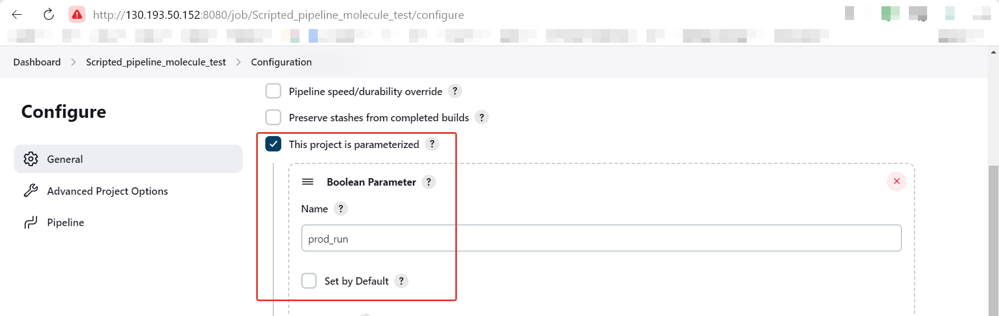
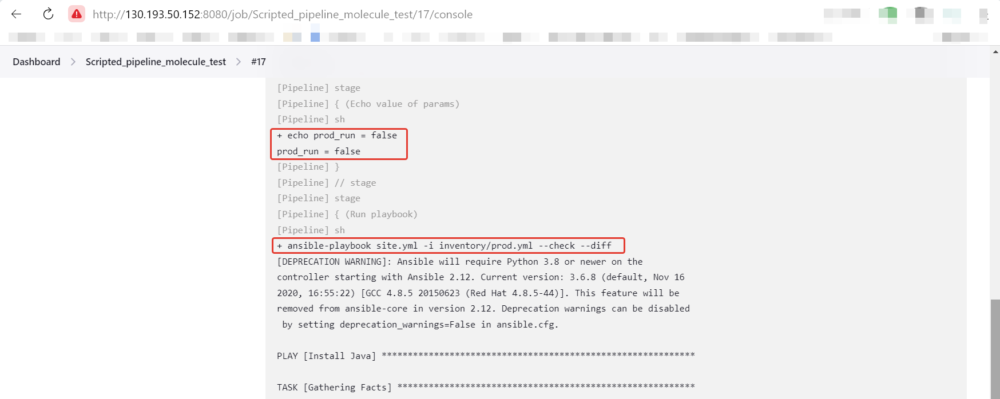

# Домашнее задание к занятию "09.04 Jenkins"

## Подготовка к выполнению

1. Создать 2 VM: для jenkins-master и jenkins-agent.
    |ID |NAME |ZONE ID |STATUS |EXTERNAL IP |INTERNAL IP |
    |---|---|---|---|---|---|
    | fhm4363l708p2di4a1nl | jenkins-master | ru-central1-a | RUNNING | 130.193.50.152 | 10.128.0.7  |
    | fhmi8oe70993f3t73347 | jenkins-agent  | ru-central1-a | RUNNING | 130.193.51.249 | 10.128.0.34 |
2. Установить jenkins при помощи playbook'a.
3. Запустить и проверить работоспособность.
4. Сделать первоначальную настройку: **http://130.193.50.152:8080/**
   

## Основная часть

1. Сделать Freestyle Job, который будет запускать `molecule test` из любого вашего репозитория с ролью.
2. Сделать Declarative Pipeline Job, который будет запускать `molecule test` из любого вашего репозитория с ролью.
3. Перенести Declarative Pipeline в репозиторий в файл `Jenkinsfile`:**[Jenkinsfile]([Jenkinsfile](https://github.com/duxaxa/lighthouse-role/blob/main/Jenkinsfile))**
4. Создать Multibranch Pipeline на запуск `Jenkinsfile` из репозитория.
5. Создать Scripted Pipeline, наполнить его скриптом из [pipeline](./pipeline).
6. Внести необходимые изменения, чтобы Pipeline запускал `ansible-playbook` без флагов `--check --diff`, если не установлен параметр при запуске джобы (prod_run = True), по умолчанию параметр имеет значение False и запускает прогон с флагами `--check --diff`.
   
7. Проверить работоспособность, исправить ошибки, исправленный Pipeline вложить в репозиторий в файл `ScriptedJenkinsfile`: **[ScriptedJenkinsfile](ScriptedJenkinsfile)**
    

    
8. Отправить ссылку на репозиторий с ролью и Declarative Pipeline и Scripted Pipeline:
   
   **[Declarative Pipeline](https://github.com/duxaxa/lighthouse-role/blob/main/Jenkinsfile)**  
      **[Scripted Pipeline](https://github.com/duxaxa/devops-netology/blob/main/09-ci-04-jenkins/ScriptedJenkinsfile)**

## Необязательная часть

1. Создать скрипт на groovy, который будет собирать все Job, которые завершились хотя бы раз неуспешно. Добавить скрипт в репозиторий с решением с названием `AllJobFailure.groovy`.
2. Создать Scripted Pipeline таким образом, чтобы он мог сначала запустить через Ya.Cloud CLI необходимое количество инстансов, прописать их в инвентори плейбука и после этого запускать плейбук. Тем самым, мы должны по нажатию кнопки получить готовую к использованию систему.

---

### Как оформить ДЗ?

Выполненное домашнее задание пришлите ссылкой на .md-файл в вашем репозитории.

---
